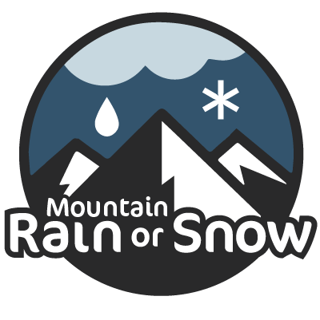

# Welcome to _Mountain Rain or Snow_!

*Mountain Rain or Snow* is a citizen science project devoted to better observing precipitation phase (i.e., rain, snow, or mixed) at the land surface. Led by a group of researchers from [Lynker](https://www.lynker.com/), the [Desert Research Institute](https://www.dri.edu/), and the [University of Nevada, Reno](https://www.unr.edu/), we're powered by hundreds of volunteers who report precipitation phase when the weather outside is frightful.

We use these crowdsourced data on precipitation phase to evaluate how well hydrologic models, gridded weather products, and earth-observing satellites estimate rain versus snow. If you're interested, check out the [analysis](https://github.com/SnowHydrology/MountainRainOrSnow/tree/main/analysis) section of this repo for a quick look at the data. 

# Get involved

We're always looking for more reports of rain, snow, and mixed precipitation. During the 2021–2022 field season we'll be focusing on gathering observations from the Sierra Nevada (California and Nevada), Cascades (Oregon and Washington), Rocky Mountains (Colorado), and Adirondacks and Appalachians of New York and New England. 

We'll soon be launching our new website and mobile app. Links will be posted **here** once they're live!

# Learn more

More information on our work can be found at the links below:

* [A peer-reviewed publication on our first year of data and analysis (Arienzo et al., 2021)](https://doi.org/10.3389/feart.2021.617594)
* [A blog post on why accurately predicting rain versus snow matters](https://blogs.egu.eu/divisions/cr/2021/02/12/rain-or-snow-answering-the-question-with-citizen-scientists/)
* [A 2020 report on our data](https://www.dri.edu/project/tahoe-rain-or-snow/) (2021 report coming soon!)

# Acknowledgments

We started this work in 2019 as *Tahoe Rain or Snow* thanks to funding from the [NASA Nevada EPSCoR Program](https://nasa.epscorspo.nevada.edu/). In 2021, we received funding to continue and expand the project with an award from the [NASA ROSES Citizen Science for Earth Systems Program](https://earthdata.nasa.gov/esds/competitive-programs/csesp).

None of this would be possible without the dedication of tireless volunteers. Thank you!

