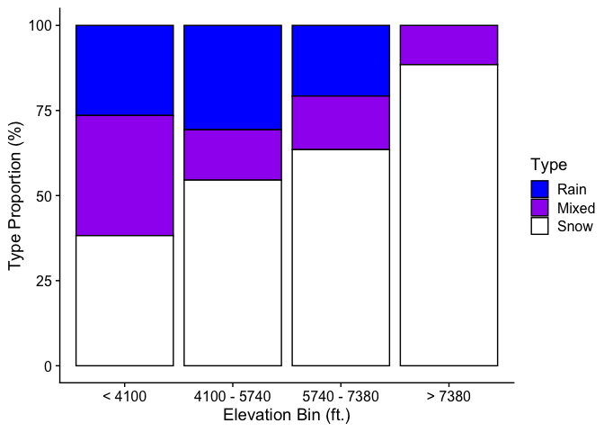
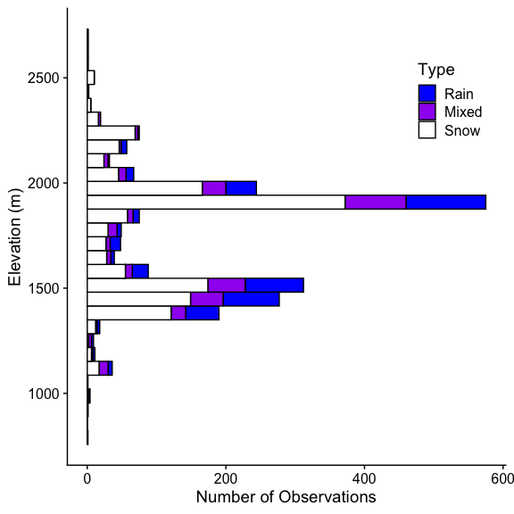

Mountain Rain or Snow 2020-2021 Analysis
================
Keith Jennings
7/26/2021

# Introduction

The `Analysis` directory includes the processing scripts used to
evaluate precipitation phase data submitted by citizen scientists taking
part in *Mountain Rain or Snow*. This includes pre-processing the
observations, downloading ancillary meteorological data, estimating air
temperature at each observation point, and quality controlling the
precipitation phase reports.

The analysis below includes observations submitted near Lake Tahoe
during the 2020 and 2021 campaigns.

# Step 1: Data Pre-Processing

The `mros_cit_sci_obs_preprocess.R` script in `analysis/pre_processing`
associates the following geospatial data with each observation:

  - Level II, III, and IV Ecoregions
  - US State
  - Elevation (m)

The script also formats the time data and removes all observations
submitted without geolocation info.

# Step 2: Meteorological Data Download and Pre-Processing

Few of the citizen science observations are submitted near existing
meteorological measurement stations, meaning we need to model the air
temperature for each rain, snow, mixed data point. We do this with air
temperature data from four
networks:

| Network Name | URL                                                      |
| ------------ | -------------------------------------------------------- |
| HADS         | <https://mesonet.agron.iastate.edu/request/dcp/fe.phtml> |
| SNOTEL       | <https://wcc.sc.egov.usda.gov/reportGenerator/>          |
| RAWS         | <https://raws.dri.edu/>                                  |
| NCDC LCD     | <https://gis.ncdc.noaa.gov/maps/ncei/lcd>                |

The two intial datasets can be accessed programatically using
`analysis/download/data_download_hads.R` and
`analysis/download/data_download_snotel.R` while the latter two need to
be downloaded manually from the links. After downloading the data, we
prepare them for the temperature model using
`analysis/pre_processing/mros_met_data_preprocess.R`.

# Step 3: Air Temperature Modeling

We then model the air temperature at each location using four methods in
the `analysis/met_modeling/mros_air_temperature_model.R` script:

  - Inverse distance weighting (IDW), plus a constant lapse rate of
    -0.005°C/m
  - IDW, plus a variable lapse rate computed from air temperature
    observations
  - Nearest met station, plus a constant lapse rate of -0.005°C/m
  - Nearest met station, plus a variable lapse rate computed from air
    temperature observations

As a result of its higher performance in terms of mean bias and
r<sup>2</sup>, we use the IDW plus variable lapse rate method when
assigning air temperature to each observation point.

Future versions of the code will model additional meteorological
variables, such as relative humidity, dew point temperature, and wet
bulb temperature.

# Step 4: Quality Control of Citizen Science Observations

Next, we flag observations based on five criteria:

1.  Whether precipitation was recorded that day at the nearby NCDC LCD
    met stations.
2.  The estimated air temperature relative to realistic values for rain
    and snow.
3.  The relative humidity at the observation point
4.  Average distance from the met stations.
5.  If the timestamp was a duplicate of an observation from the same
    observer.

We then output the processed, quality controlled observations to a
shareable data file: `data/processed/mros_obs_processed_2020_2021.RDS`

# Looking at the data

Now we can examine the data more in depth. First, we’ll start an R
session and import the file:

``` r
# Load the tidyverse
library(tidyverse)

# Use cowplot for plot formatting and import plot styles
library(cowplot); theme_set(theme_cowplot())
source("functions/mros_plot_formats.R")

# Import data
obs <- readRDS("../data/processed/mros_obs_processed_2020_2021.RDS")

# Add factor level to phase to force Rain > Mixed > Snow order
obs <- obs %>% mutate(phase = factor(phase, levels = c("Rain", "Mixed", "Snow")))
```

Within the `obs` file we have a total of 2495 observations submitted
between 2020-01-08 and 2021-05-23 in the Lake Tahoe area. Of these 2495
observations, 2211 passed all of the quality control checks (this is
88.6% of the database).

For the rest of document, we’ll evaluate data from the 2021 sampling
season only (2020-10-01 through 2021-05-23).

``` r
obs2021 <- filter(obs, date >= as.Date("2020-10-01"))
```

In this second year of the project, we recorded 1464 observations, 86.5%
of which passed the QC checks.

We can filter the dataset to the passing observations only and examine
precipitation phase patterns by elevation.

``` r
# Filter to passing obs
obs2021pass <- filter(obs2021, tair_flag == "Pass" & 
                        ppt_flag == "Pass" & 
                        rh_flag == "Pass" &
                        dist_flag == "Pass" & 
                        dupe_flag == "Pass")

# Add elevation info
obs2021pass <- obs2021pass %>% 
   mutate(elev_bin = cut_width(elev, width = 500))
```

The elevational breakdown of precipitation phase looks like this:

<!-- -->

Similarly, we can look at the number of reports per precipitation phase
by elevation:

<!-- -->
