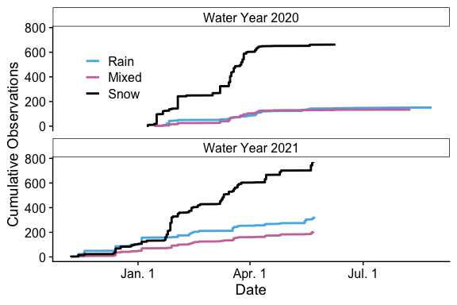
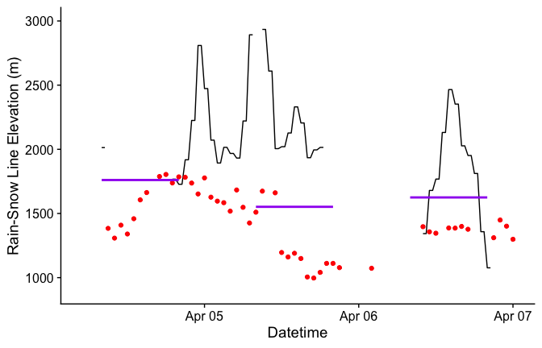

Mountain Rain or Snow 2020-2021 Analysis
================
Keith Jennings
7/26/2021

# Introduction

The `Analysis` directory includes the processing scripts used to
evaluate precipitation phase data submitted by citizen scientists taking
part in *Mountain Rain or Snow*. This includes pre-processing the
observations, downloading ancillary meteorological data, estimating air
temperature at each observation point, and quality controlling the
precipitation phase reports.

The analysis below includes observations submitted near Lake Tahoe
during the 2020 and 2021 campaigns.

# Step 1: Data Pre-Processing

The `mros_cit_sci_obs_preprocess.R` script in `analysis/pre_processing`
associates the following geospatial data with each observation:

-   Level II, III, and IV Ecoregions
-   US State
-   Elevation (m)

The script also formats the time data and removes all observations
submitted without geolocation info.

# Step 2: Meteorological Data Download and Pre-Processing

Few of the citizen science observations are submitted near existing
meteorological measurement stations, meaning we need to model the air
temperature for each rain, snow, mixed data point. We do this with air
temperature data from four networks:

| Network Name | URL                                                      |
|--------------|----------------------------------------------------------|
| HADS         | <https://mesonet.agron.iastate.edu/request/dcp/fe.phtml> |
| SNOTEL       | <https://wcc.sc.egov.usda.gov/reportGenerator/>          |
| RAWS         | <https://raws.dri.edu/>                                  |
| NCDC LCD     | <https://gis.ncdc.noaa.gov/maps/ncei/lcd>                |

The two intial datasets can be accessed programatically using
`analysis/download/data_download_hads.R` and
`analysis/download/data_download_snotel.R` while the latter two need to
be downloaded manually from the links. After downloading the data, we
prepare them for the temperature model using
`analysis/pre_processing/mros_met_data_preprocess.R`.

# Step 3: Air Temperature Modeling

We then model the air temperature at each location using four methods in
the `analysis/met_modeling/mros_air_temperature_model.R` script:

-   Inverse distance weighting (IDW), plus a constant lapse rate of
    -0.005°C/m
-   IDW, plus a variable lapse rate computed from air temperature
    observations
-   Nearest met station, plus a constant lapse rate of -0.005°C/m
-   Nearest met station, plus a variable lapse rate computed from air
    temperature observations

As a result of its higher performance in terms of mean bias and
r<sup>2</sup>, we use the IDW plus variable lapse rate method when
assigning air temperature to each observation point.

Future versions of the code will model additional meteorological
variables, such as relative humidity, dew point temperature, and wet
bulb temperature.

# Step 4: Quality Control of Citizen Science Observations

Next, we flag observations based on five criteria:

1.  Whether precipitation was recorded that day at the nearby NCDC LCD
    met stations.
2.  The estimated air temperature relative to realistic values for rain
    and snow.
3.  The relative humidity at the observation point
4.  Average distance from the met stations.
5.  If the timestamp was a duplicate of an observation from the same
    observer.

We then output the processed, quality controlled observations to a
shareable data file: `data/processed/mros_obs_processed_2020_2021.RDS`

# Looking at the data

Now we can examine the data more in depth. First, we’ll start an R
session and import the file:

``` r
# Load the tidyverse
library(tidyverse)

# Use cowplot for plot formatting and import plot styles
library(cowplot); theme_set(theme_cowplot())
source("functions/mros_plot_formats.R")

# Lubridate for date handling tools
library(lubridate)

# Import data
obs <- readRDS("../data/processed/mros_obs_processed_2020_2021.RDS")

# Add factor level to phase to force Rain > Mixed > Snow order
obs <- obs %>% mutate(phase = factor(phase, levels = c("Rain", "Mixed", "Snow")))
```

Within the `obs` file we have a total of 2495 observations submitted
between 2020-01-08 and 2021-05-23 in the Lake Tahoe area. Of these 2495
observations, 2248 passed all of the quality control checks (this is
90.1% of the database).

For the rest of document, we’ll evaluate only data that passed the QC
checks. We’ll also add elevation bins for additional analyses

``` r
# Filter to passing obs
obsPass <- filter(obs, tair_flag == "Pass" & 
                        ppt_flag == "Pass" & 
                        rh_flag == "Pass" &
                        dist_flag == "Pass" & 
                        dupe_flag == "Pass")

# Add elevation info
obsPass <- obsPass %>% 
   mutate(elev_bin = cut_width(elev, width = 500))
```

## Observations by elevation

We received precipitation reports in the study area between 771 m and
2680 m, with mean and median report elevations of 1742 m and 1844 m,
respectively. In total, there were 1438, 472, 338, snow, rain, and mixed
observations.

The elevational breakdown of precipitation phase looks like this:

<!-- -->

Similarly, we can look at the number of reports per precipitation phase
by elevation:

<!-- -->

Or grouped together:

<!-- -->

## Observations by state and ecoregion

Across the study period, we had the following geographic breakdown of
observations.

By state:

| state      |    n |
|:-----------|-----:|
| California | 1069 |
| Nevada     | 1179 |

By US EPA Level III Ecoregion:

| eco_l3                  |    n |
|:------------------------|-----:|
| Central Basin and Range |  827 |
| Sierra Nevada           | 1421 |

And by US EPA Level IV Ecoregion:

| eco_l4                                             |    n |
|:---------------------------------------------------|-----:|
| Central Sierra Lower Montane Forests               |   41 |
| Central Sierra Mid-Montane Forests                 |   10 |
| Lahontan Salt Shrub Basin                          |   10 |
| Northeastern Sierra Mixed Conifer-Pine Forests     | 1094 |
| Northern Sierra Mid-Montane Forests                |   15 |
| Northern Sierra Subalpine Forests                  |    9 |
| Northern Sierra Upper Montane Forests              |  252 |
| Sierra Nevada-Influenced Ranges                    |    6 |
| Sierra Nevada-Influenced Semiarid Hills and Basins |  811 |

## Observations by year

Our *Tahoe Rain or Snow* study period comprised two water years: 2020
and 2021.

``` r
# Add water year info
obsPass <- obsPass %>% 
   mutate(wy = ifelse(month(date) >= 10,
                      year(date) + 1,
                      year(date)),
          dowy = ifelse(month(date) >= 10,
                        yday(date) - 273,
                        yday(date) + 92))

# Compute cumulative observations per phase and water year
obsPass <- obsPass %>% 
  arrange(date) %>% 
  group_by(wy, phase) %>% 
  mutate(n_cumulative = row_number())
```

We received 953 observations in water year 2020 and 1295 in 2021. Snow
was the most frequent phase in both water years, but both rain and mixed
precipitation increased in relative proportion in 2021.

|   wy | phase |   n |  pct |
|-----:|:------|----:|-----:|
| 2020 | Rain  | 151 | 15.8 |
| 2020 | Mixed | 134 | 14.1 |
| 2020 | Snow  | 668 | 70.1 |
| 2021 | Rain  | 321 | 24.8 |
| 2021 | Mixed | 204 | 15.8 |
| 2021 | Snow  | 770 | 59.5 |

<!-- -->

## Observations by air temperature

Modeled meteorological data show volunteers submitted precipitation
phase reports from a minimum air temperature value of -10.2°C to a
maximum of 25.7°C with a median value of 1.1°C. What’s more, the vast
majority of reports came from a relatively narrow air temperature range.
Our data show 95% of observations corresponded to air temperatures
between -5.1°C and 9.6°C.

We also found differing patterns when examining the distributions of the
precipitation phase types by air, wet bulb, and dew point temperature.
In each case, there was marked overlap in the phase distributions by
temperature, underscoring the difficulty in using near-surface
meteorological data to partition rain, snow, and mixed precipitation.
The distributions for rain and snow, for example, overlapped by 52.8%,
43.8%, and 45.7% for air, wet bulb, and dew point temperature,
respectively. This suggests wet bulb temperature is a more sensitive
predictor of rain versus snow relative to the other temperature types,
while air temperature is the least sensitive. Similarly, air temperature
had the highest percent overlap between snow and mixed (72.8%) and rain
and mixed phases (75.3%).

<!-- -->

## Rain-snow partitioning

Using the observations and modeled meteorological data, we can compute
snowfall probability curves and 50% snowfall probability temperatures,
the latter of which are used as thresholds in models to split solid and
liquid precipitation. We provide a methods overview here and the full
code can be found in `mros_obs_analysis.R`. In short, we bin air
temperature in 1°C increments from -10°C to 20°C and wet bulb
temperature in 1°C increments from -12°C to 16°C. We then compute the
probability of snowfall occurring in each air and wet bulb temperature
bin. Those data are next fit with a hyperbolic tangent as in Dai (2008)
and Jennings et al. (2018) to create snowfall probability curves. The
50% snowfall probability air and wet bulb temperature thresholds are
where the fitted curves pass the 50% mark.

Let’s import the data.

``` r
# Import data
rs_p <- readRDS("../data/processed/mros_obs_rs_partitioning_2020_2021.RDS")
```

We can then look at the air temperature snowfall probability plot:

<!-- -->

The wet bulb temperature snowfall probability plot:

<!-- -->

And the two of them combined:

<!-- -->

We notice the 50% threshold is a fair bit higher for air temperature
verus wet bulb temperature, which is expected because the former is
always warmer than the latter when relative humidity is less than 100%.
We also see a fair bit more noise in the curve for air temperature
between approximately 25% and 50%.

| phase |  mean_rh | temp     |
|:------|---------:|:---------|
| Rain  | 79.73312 | air      |
| Mixed | 72.74908 | air      |
| Snow  | 65.55655 | air      |
| Rain  | 82.74519 | wet bulb |
| Mixed | 77.43236 | wet bulb |
| Snow  | 69.99865 | wet bulb |

## 

<!-- -->

<!-- -->

<!-- -->

<!-- -->

## Precipitation phase partitioning method comparison

Import the summary data produced in
`analysis/rain_snow/mros_method_comparison.R`

``` r
# import the summary and summary by tair data
method_summary <- readRDS("../data/processed/mros_obs_sim_summary.RDS")
method_summary_byTair <- readRDS("../data/processed/mros_obs_sim_summary_byTair.RDS")
```

And make a tri-panel plot showing method success rate by air temperature
for the three evaluation scenarios

<!-- -->

## GPM IMERG comparison

``` r
# Import data
gpm <- readRDS("../data/processed/mros_gpm_processed_2020_2021.RDS")

# Join the data
obsGPM <- left_join(obsPass,
                    gpm,
                    by = "id")

###############################################################################
# Summarize correct observations by temp bin

# Make wider bins for analysis
tair_max = 14
tair_min = -7
tair_bin_width = 1
obsGPM$tair_bin2 <- cut(obsGPM$tair, 
                     breaks = seq(tair_min, 
                                  tair_max, 
                                  by = tair_bin_width))


# Add numeric version of each bin
tair_cuts_to_number2 <- data.frame("tair_bin2" = levels(obsGPM$tair_bin2),
                                   "tair_bin_num2" = seq(tair_min + (0.5 * tair_bin_width),
                                                         tair_max - (0.5 * tair_bin_width), 
                                                         by = tair_bin_width))

# Join
obsGPM <- left_join(obsGPM, tair_cuts_to_number2, by = "tair_bin2")


# Add GPM probability thresholds for rain, snow, mixed
prob_thresh_upper_rain = 100
prob_thresh_lower_rain = 50
prob_thresh_upper_snow = 50
prob_thresh_lower_snow = 0
prob_thresh_upper_mixed = prob_thresh_lower_rain
prob_thresh_lower_mixed = prob_thresh_upper_snow

# Denote whether phase designation was correct or not
obsGPM$phase2 <- as.character(obsGPM$phase)
obsGPM <- obsGPM %>% 
  mutate(phase_noMIXED = case_when(phase2 == "Mixed" ~ "Rain",
                                   TRUE ~ phase2),
         gpm_phase = case_when(gpm_prob <= prob_thresh_upper_snow &
                                 gpm_prob >= prob_thresh_lower_snow ~ "Snow",
                               gpm_prob <= prob_thresh_upper_rain &
                                 gpm_prob >= prob_thresh_lower_rain ~ "Rain",
                               gpm_prob < prob_thresh_upper_mixed &
                                 gpm_prob > prob_thresh_lower_mixed~ "Mixed"),
         gpm_score = case_when(gpm_phase == phase2 ~ 1,
                               gpm_phase != phase2 ~ 0),
         gpm_score_noMIXED = case_when(gpm_phase == phase_noMIXED ~ 1,
                                       gpm_phase != phase_noMIXED ~ 0))

# Summarize by tair bin
gpm_summary_noMIXED <- obsGPM %>% 
  filter(!is.na(gpm_score_noMIXED)) %>% 
  group_by(tair_bin_num2) %>% 
  summarize(n_obs = length(gpm_score_noMIXED), 
            gpm_perf_pct = (sum(gpm_score_noMIXED) / n_obs) * 100,
            snow_pct_obs = (sum(phase == "Snow") / n_obs) * 100,
            snow_pct_gpm = (sum(gpm_phase == "Snow") / n_obs) * 100)
```

Then plot the analyzed results:

<!-- -->

## Rain-snow line comparison

TODO: Add the following:

``` r
# valid_dates = filter(rain_snow_line, note == "valid" & n > 10)$date
# ggplot(filter(obs_by_elev_date, date %in% valid_dates), aes(elev, snow_prob)) + geom_point() + geom_vline(data = filter(rain_snow_line, date %in% valid_dates), aes(xintercept = rs_line)) + facet_wrap(~date) + xlim(min(obs_by_elev_date$elev), max(obs_by_elev_date$elev)) + geom_hline(yintercept = 50)
```

Import the data

``` r
library(lubridate) # for datetime handling

# Import data
gpm <- readRDS("../data/processed/gpm_rain_snow_line_2020_2021.RDS") %>% 
  mutate(datetime = with_tz(datetime, "Etc/Gmt+8")) # convert to PST
flr <- read.csv("../data/processed/CFF_2019_2021.csv", na.strings = " NaN") %>% 
  mutate(datetime = with_tz(as.POSIXct(paste0(year, "-", month, "-", day, " ", hour),
                               format = "%Y-%m-%d %H",
                               tz = "GMT"),
                            "Etc/Gmt+8"), # convert to PST
         rain_snow_line = BBH * 1000) # convert from km to m
obs <- readRDS("../data/processed/mros_obs_rain_snow_line_2020-2021.RDS") %>% 
  mutate(datetime_min = as.POSIXct(paste0(date, " 08:00"), 
                                   tz = "Etc/Gmt+8"),
         datetime_max = as.POSIXct(paste0(date, " 20:00"), 
                                   tz = "Etc/Gmt+8"))

# Join data
all <- left_join(gpm, flr, by = "datetime")
```

Plot an event:

<!-- -->
