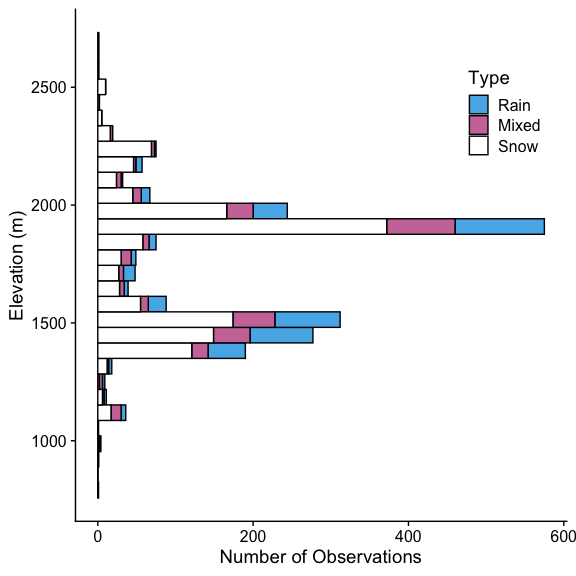
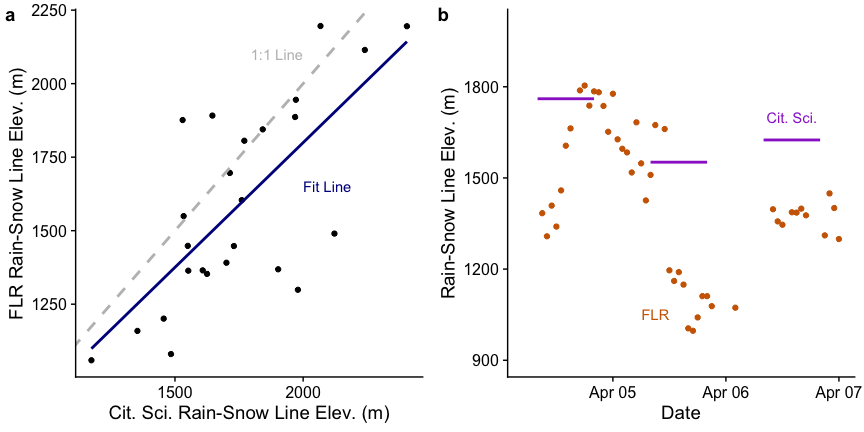
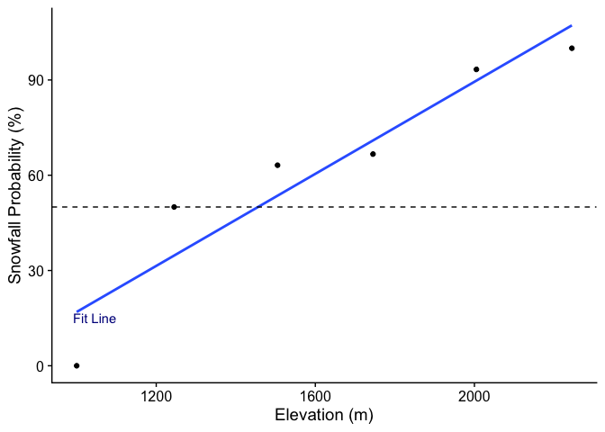

Mountain Rain or Snow 2020-2021 Analysis
================
Keith Jennings
7/26/2021

# Introduction

The `Analysis` directory includes the processing scripts used to
evaluate precipitation phase data submitted by citizen scientists taking
part in *Mountain Rain or Snow*. This includes pre-processing the
observations, downloading ancillary meteorological data, estimating air
temperature at each observation point, and quality controlling the
precipitation phase reports.

The analysis below includes observations submitted near Lake Tahoe
during the 2020 and 2021 campaigns.

# Step 1: Data Pre-Processing

The `mros_cit_sci_obs_preprocess.R` script in `analysis/pre_processing`
associates the following geospatial data with each observation:

- Level II, III, and IV Ecoregions
- US State
- Elevation (m)

The script also formats the time data and removes all observations
submitted without geolocation info.

# Step 2: Meteorological Data Download and Pre-Processing

Few of the citizen science observations are submitted near existing
meteorological measurement stations, meaning we need to model the air
temperature for each rain, snow, mixed data point. We do this with air
temperature data from four networks:

| Network Name | URL                                                      |
|--------------|----------------------------------------------------------|
| HADS         | <https://mesonet.agron.iastate.edu/request/dcp/fe.phtml> |
| SNOTEL       | <https://wcc.sc.egov.usda.gov/reportGenerator/>          |
| RAWS         | <https://raws.dri.edu/>                                  |
| NCDC LCD     | <https://gis.ncdc.noaa.gov/maps/ncei/lcd>                |

The two intial datasets can be accessed programatically using
`analysis/download/data_download_hads.R` and
`analysis/download/data_download_snotel.R` while the latter two need to
be downloaded manually from the links. After downloading the data, we
prepare them for the temperature model using
`analysis/pre_processing/mros_met_data_preprocess.R`.

# Step 3: Air Temperature Modeling

We then model the air temperature at each location using four methods in
the `analysis/met_modeling/mros_air_temperature_model.R` script:

- Inverse distance weighting (IDW), plus a constant lapse rate of
  -0.005°C/m
- IDW, plus a variable lapse rate computed from air temperature
  observations
- Nearest met station, plus a constant lapse rate of -0.005°C/m
- Nearest met station, plus a variable lapse rate computed from air
  temperature observations

As a result of its higher performance in terms of mean bias and
r<sup>2</sup>, we use the IDW plus variable lapse rate method when
assigning air temperature to each observation point.

Future versions of the code will model additional meteorological
variables, such as relative humidity, dew point temperature, and wet
bulb temperature.

# Step 4: Quality Control of Citizen Science Observations

Next, we flag observations based on five criteria:

1.  Whether precipitation was recorded that day at the nearby NCDC LCD
    met stations.
2.  The estimated air temperature relative to realistic values for rain
    and snow.
3.  The relative humidity at the observation point
4.  Average distance from the met stations.
5.  If the timestamp was a duplicate of an observation from the same
    observer.

We then output the processed, quality controlled observations to a
shareable data file: `data/processed/mros_obs_processed_2020_2021.RDS`

# Looking at the data

Now we can examine the data more in depth. First, we’ll start an R
session and import the file:

``` r
# Load the tidyverse
library(tidyverse)

# Use cowplot for plot formatting and import plot styles
library(cowplot); theme_set(theme_cowplot())
source("functions/mros_plot_formats.R")

# Make a second fill scale to be colorblind friendly
phase_fill_scale2 = scale_fill_manual(name = "Type", 
                                      values = c("#56B4E9", "#CC79A7", "white"))

phase_color_scale2 = scale_color_manual(name = "Type", 
                                      values = c("#56B4E9", "#CC79A7", "black"))

# Lubridate for date handling tools
library(lubridate)

# Import data
obs <- readRDS("../data/processed/mros_obs_processed_2020_2021.RDS")

# Add factor level to phase to force Rain > Mixed > Snow order
obs <- obs %>% mutate(phase = factor(phase, levels = c("Rain", "Mixed", "Snow")))
```

Within the `obs` file we have a total of 2495 observations submitted
between 2020-01-08 and 2021-05-23 in the Lake Tahoe area. Of these 2495
observations, 2248 passed all of the quality control checks (this is
90.1% of the database).

For the rest of document, we’ll evaluate only data that passed the QC
checks. We’ll also add elevation bins for additional analyses

``` r
# Filter to passing obs
obsPass <- filter(obs, tair_flag == "Pass" & 
                        ppt_flag == "Pass" & 
                        rh_flag == "Pass" &
                        dist_flag == "Pass" & 
                        dupe_flag == "Pass")

# Add elevation info
obsPass <- obsPass %>% 
   mutate(elev_bin = cut_width(elev, width = 500))

# Summarize by day
obsDaily <- obsPass %>% group_by(date) %>% summarize(n = n(), snow_pct = sum(phase == "Snow")/n() * 100, rain_pct = sum(phase == "Rain")/n() * 100, mixed_pct = sum(phase == "Mixed")/n() * 100 )
```

## Observations by elevation

We received precipitation reports in the study area between 771 m and
2680 m, with mean and median report elevations of 1742 m and 1844 m,
respectively. In total, there were 1438, 472, 338, snow, rain, and mixed
observations.

The elevational breakdown of precipitation phase looks like this:

<!-- -->

Similarly, we can look at the number of reports per precipitation phase
by elevation:

<!-- -->

Or grouped together:

<!-- -->

## Observations by state and ecoregion

Across the study period, we had the following geographic breakdown of
observations.

By state:

| state      |    n |
|:-----------|-----:|
| California | 1069 |
| Nevada     | 1179 |

By US EPA Level III Ecoregion:

| eco_l3                  |    n |
|:------------------------|-----:|
| Central Basin and Range |  827 |
| Sierra Nevada           | 1421 |

And by US EPA Level IV Ecoregion:

| eco_l4                                             |    n |
|:---------------------------------------------------|-----:|
| Central Sierra Lower Montane Forests               |   41 |
| Central Sierra Mid-Montane Forests                 |   10 |
| Lahontan Salt Shrub Basin                          |   10 |
| Northeastern Sierra Mixed Conifer-Pine Forests     | 1094 |
| Northern Sierra Mid-Montane Forests                |   15 |
| Northern Sierra Subalpine Forests                  |    9 |
| Northern Sierra Upper Montane Forests              |  252 |
| Sierra Nevada-Influenced Ranges                    |    6 |
| Sierra Nevada-Influenced Semiarid Hills and Basins |  811 |

## Observations by year

Our *Tahoe Rain or Snow* study period comprised two water years: 2020
and 2021.

``` r
# Add water year info
obsPass <- obsPass %>% 
   mutate(wy = ifelse(month(date) >= 10,
                      year(date) + 1,
                      year(date)),
          dowy = ifelse(month(date) >= 10,
                        yday(date) - 273,
                        yday(date) + 92))

# Compute cumulative observations per phase and water year
obsPass <- obsPass %>% 
  arrange(date) %>% 
  group_by(wy, phase) %>% 
  mutate(n_cumulative = row_number())
```

We received 953 observations in water year 2020 and 1295 in 2021. Snow
was the most frequent phase in both water years, but both rain and mixed
precipitation increased in relative proportion in 2021.

|   wy | phase |   n |  pct |
|-----:|:------|----:|-----:|
| 2020 | Rain  | 151 | 15.8 |
| 2020 | Mixed | 134 | 14.1 |
| 2020 | Snow  | 668 | 70.1 |
| 2021 | Rain  | 321 | 24.8 |
| 2021 | Mixed | 204 | 15.8 |
| 2021 | Snow  | 770 | 59.5 |

<!-- -->

## Observations by air temperature

According to modeled air temperature data, volunteers submitted
precipitation phase reports from a minimum air temperature value of
-10.2°C to a maximum of 25.7°C with a median value of 1.1°C. The vast
majority of reports came from a relatively narrow air temperature range.
Our data show 95% of observations corresponded to air temperatures
between -5.1°C and 9.6°C. 45.2% of reported precipitation fell between
0°C and 4°C, the air temperature range identified by previous research
to have the greatest rain-snow partitioning uncertainty.

We also found marked overlap in the phase distributions by temperature,
underscoring the difficulty in using near-surface meteorological data to
partition rain, snow, and mixed precipitation (FIG XXXX). The
distributions for rain and snow, for example, overlapped by 52.8%,
43.8%, and 45.5% for air, wet bulb, and dew point temperature,
respectively. This suggests wet bulb temperature is a more sensitive
predictor of rain versus snow relative to the other temperature types,
while air temperature is the least sensitive. Air temperature also had
the highest percent overlap between snow and mixed (72.9%) and rain and
mixed phases (75.1%). The minimum overlap between mixed precipitation
and another phase was 67.5%, indicating the near-surface meteorological
conditions favoring mixed precipitation are often indistinguishable from
rain and snow.

<!-- -->

## Rain-snow partitioning

Using the observations and modeled meteorological data, we can compute
snowfall probability curves and 50% snowfall probability temperatures,
the latter of which are used as thresholds in models to split solid and
liquid precipitation. We provide a methods overview here and the full
code can be found in `mros_obs_analysis.R`. In short, we bin air
temperature in 1°C increments from -10°C to 20°C and wet bulb
temperature in 1°C increments from -12°C to 16°C. We then compute the
probability of snowfall occurring in each air and wet bulb temperature
bin. Those data are next fit with a hyperbolic tangent as in Dai (2008)
and Jennings et al. (2018) to create snowfall probability curves. The
50% snowfall probability air and wet bulb temperature thresholds are
where the fitted curves pass the 50% mark.

Let’s import the data.

``` r
# Import data
rs_p <- readRDS("../data/processed/mros_obs_rs_partitioning_2020_2021.RDS")
```

We can then look at the air temperature snowfall probability plot:

<!-- -->

The wet bulb temperature snowfall probability plot:

<!-- -->

The dew point temperature snowfall probability plot:

<!-- -->

And the three of them combined:

<!-- -->

When evaluating snowfall probability from the crowdsourced data by air,
wet bulb, and dew point temperature, we see the expected reverse sigmoid
curve (Fig. XXXX). In all cases probability is near 100% for the coldest
temperatures before decreasing as temperature warms. There are two
noticeable features of the air temperature curves: 1) the observed curve
has a greater amount of noise than the curves for wet bulb and dew point
temperature and 2) the fitted probability curve has a shallower gradient
near 50%, confirming the metric’s reduced sensitivity to rain-snow
partitioning. The 50% snowfall probability thresholds derived from
hyperbolic tangent curves fit to the citizen science data are 3.9°C,
0.9°C, and -0.5°C for air, wet bulb, and dew point temperature,
respectively. We expect threshold values to follow this trend as
T<sub>dew</sub> \< T<sub>wet</sub> \< T<sub>air</sub> when relative
humidity is less than 100%.

<!-- -->

| phase |  mean_rh | temp     |
|:------|---------:|:---------|
| Rain  | 79.76564 | air      |
| Mixed | 72.78463 | air      |
| Snow  | 65.64661 | air      |
| Rain  | 82.96879 | wet bulb |
| Mixed | 77.73126 | wet bulb |
| Snow  | 70.02283 | wet bulb |

## 

<!-- -->

<!-- -->

<!-- -->

<!-- --> \##
Rain-snow lines from the citizen science data

``` r
# Import processed rain-snow line data
rain_snow_line <- readRDS("../data/processed/mros_obs_rain_snow_line_2020-2021.RDS")

# Import the probabilities by elevation bin
rain_snow_prob_elev <- readRDS("../data/processed/mros_obs_rain_snow_prob_elev_2020-2021.RDS")

# Get valid dates from data
valid_dates = filter(rain_snow_line, note == "valid" &
                       n >= 10 &
                       rs_line <= max(obsPass$elev) &
                       rs_line >= min(obsPass$elev))$date

# Plot
ggplot(filter(rain_snow_prob_elev, date %in% valid_dates), 
       aes(snow_prob, elev)) + 
  geom_point() + 
  geom_hline(data = filter(rain_snow_line, date %in% valid_dates), aes(yintercept = rs_line)) + 
  facet_wrap(~date) 
```

<!-- --> During the
study period, we had 32 days when we could estimate a valid rain-snow
line elevation from the citizen science data. We did not consider values
above the maximum or below the minimum observation elevation to be
valid. That means of the 69 days with at least 10 observations, we could
compute daily rain-snow lines on 46.4% of them. There were 25 days when
the maximum snowfall probability was less than 50% and 2 days when the
minimum was above 50%. In these cases we would estimate the rain-line
elevation to be above or below the study domain, respectively,
indicating rain or snow dominance. On days with valid values, daily
rain-snow line elevations ranged from a minimum of 1174 m to a maximum
of 2405 m, with a median value of 1707 m.

<!-- -->

Instances of valid daily rain-snow line estimates occurring in
succession where relatively rare during our study period.

## Precipitation phase partitioning method comparison

Import the summary data produced in
`analysis/rain_snow/mros_method_comparison.R`

``` r
# import the summary and summary by tair data
method_summary <- readRDS("../data/processed/mros_obs_sim_summary.RDS") %>% 
  filter(scenario != "thresh_tair_0" & scenario != "thresh_tair_0.5")
method_summary_byTair <- readRDS("../data/processed/mros_obs_sim_summary_byTair.RDS") %>% 
  filter(scenario != "thresh_tair_0" & scenario != "thresh_tair_0.5")
```

The different precipitation phase partitioning methods applied to the
modeled meteorological data produced marked variability in the predicted
snow, rain, and mixed proportions relative to the observations. Over our
study period, crowdsourced precipitation phase reports were comprised of
64% snow, 21% rain, and 15% mixed. In comparison, the precipitation
phase partitioning methods tended to underpredict snow and mixed
precipitation, while overpredicting rain. Snowfall frequency estimates
from the different methods ranged from a minimum of 23.8% to a maximum
of 84.5%, with an average of 60.9% and standard deviation of 18%.
Rainfall frequency estimates were similarly varied, ranging from a
minimum of 15.5% to a maximum of 56.9%, with an average of 34.6% and
standard deviation of 12.2%. Only the two air temperature ranges
predicted mixed precipitation, with frequency estimates of 14.4% and
48.1%. The other methods do not assign mixed precipitation, bringing
down the average to 4.5%.

<!-- -->

Besides the variability in the estimated frequency of the different
phases, we also quantified the performance of the methods. Although
refining their output was not the goal of this research, we do note some
relevant results here. Method success rate, where 100% equals all
precipitation phase observations correctly predicted, ranged from 41.9%
for R<sub>a1.0</sub> to 71.7% for T<sub>d0.0</sub>. The top six methods
compared to the observations all incorporated humidity in some form and,
notably, none could predict mixed precipitation as they were the wet
bulb and dew point thresholds along with the binary logistic regression
model. This meant, in practice, the best they could perform was 85%.
Even though the range methods could predict mixed precipitation, they
performed poorly overall. The best-performing air temperature method was
the optimized T<sub>a4.2</sub> from our previous study. Additionally,
there were no methods that had both snow and rain relative biases less
than 10%. In general, the methods that had low snow biases had higher
rain biases and vice versa.

For comparison sake we also reassigned mixed precipitation to be rain as
in the IMERG PLP product, which only considers precipitation to be in
the liquid or solid phase. Applying this assumption widened the range of
method success rates, which now stretched from a minimum of 38.7% for
R<sub>a1.0</sub> to 75.9% for T<sub>d0.0</sub>. Again, the top six
methods were all of the ones that incorporated humidity. In this
analysis, there were two methods, Bin<sub>log</sub> and
T<sub>w0.5</sub>, that had rain and snow frequency relative bias
magnitudes \<= 10%.

``` r
method_summary_4table <-
  left_join(filter(method_summary, eval_type == "all"),
            filter(method_summary, eval_type == "mixRain"),
                   by = "scenario") %>% 
  mutate(scenario = factor(scenario, 
                           levels=c("thresh_tair_1",
                                    "thresh_tair_1.5",
                                    "thresh_tair_1.8",
                                    "thresh_tair_1.9",
                                    "thresh_tair_2.7",
                                    "thresh_tair_4.2",
                                    "thresh_twet_0",
                                    "thresh_twet_0.5",
                                    "thresh_twet_1", 
                                    "thresh_tdew_0",
                                    "thresh_tdew_0.5",
                                    "range_tair_-0.5_0.5",
                                    "range_tair_-1_3",
                                    "binlog"))) %>% 
  arrange(scenario) %>% 
  mutate_if(is.numeric, round, digits = 1) %>% 
  as.data.frame()
rownames(method_summary_4table) <- c("T~a1.0~",
                               "T~a1.5~",
                               "T~a1.8~",
                               "T~a1.9~",
                               "T~a2.7~",
                               "T~a4.2~",
                               "T~w0.0~",
                               "T~w0.5~",
                               "T~w1.0~",
                               "T~d0.0~",
                               "T~d0.5~",
                               "R~a0.0~",
                               "R~a1.0~",
                               "Bin~log~")
method_summary_4table %>% 
  #filter(eval_type == "all" | eval_type == "mixRain") %>% 
  select(`Success Rate A` = perf_pct.x, `Snow Bias A` = snow_bias_pct.x, 
         `Rain Bias A` = rain_bias_pct.x, `Mixed Bias A` = mixed_bias_pct.x,
         `Success Rate MR` = perf_pct.y, `Snow Bias MR` = snow_bias_pct.y, 
         `Rain Bias MR` = rain_bias_pct.y, `Mixed Bias MR` = mixed_bias_pct.y) %>% 
  knitr::kable()
```

|                   | Success Rate A | Snow Bias A | Rain Bias A | Mixed Bias A | Success Rate MR | Snow Bias MR | Rain Bias MR | Mixed Bias MR |
|:------------------|---------------:|------------:|------------:|-------------:|----------------:|-------------:|-------------:|--------------:|
| T<sub>a1.0</sub>  |           58.9 |       -24.0 |       144.7 |       -100.0 |            68.4 |        -24.0 |         42.6 |           NaN |
| T<sub>a1.5</sub>  |           60.8 |       -13.5 |       112.7 |       -100.0 |            68.9 |        -13.5 |         24.0 |           NaN |
| T<sub>a1.8</sub>  |           61.1 |        -7.5 |        94.5 |       -100.0 |            68.2 |         -7.5 |         13.3 |           NaN |
| T<sub>a1.9</sub>  |           61.3 |        -6.2 |        90.5 |       -100.0 |            68.4 |         -6.2 |         11.0 |           NaN |
| T<sub>a2.7</sub>  |           63.6 |         6.7 |        51.3 |       -100.0 |            69.3 |          6.7 |        -11.9 |           NaN |
| T<sub>a4.2</sub>  |           65.7 |        28.7 |       -15.7 |       -100.0 |            68.8 |         28.7 |        -50.9 |           NaN |
| T<sub>w0.0</sub>  |           66.7 |        -6.2 |        90.5 |       -100.0 |            74.9 |         -6.2 |         11.0 |           NaN |
| T<sub>w0.5</sub>  |           68.5 |         4.8 |        57.0 |       -100.0 |            75.1 |          4.8 |         -8.5 |           NaN |
| T<sub>w1.0</sub>  |           69.2 |        16.5 |        21.4 |       -100.0 |            74.2 |         16.5 |        -29.3 |           NaN |
| T<sub>d0.0</sub>  |           71.7 |        22.3 |         3.8 |       -100.0 |            75.9 |         22.3 |        -39.5 |           NaN |
| T<sub>d0.5</sub>  |           71.0 |        32.1 |       -26.3 |       -100.0 |            74.0 |         32.1 |        -57.0 |           NaN |
| R<sub>a0.0</sub>  |           47.1 |       -55.1 |       171.0 |         -4.1 |            55.3 |        -55.1 |         57.9 |           Inf |
| R<sub>a1.0</sub>  |           41.9 |       -62.8 |        34.3 |        219.2 |            38.7 |        -62.8 |        -21.7 |           Inf |
| Bin<sub>log</sub> |           66.5 |        -2.6 |        79.7 |       -100.0 |            73.8 |         -2.6 |          4.7 |           NaN |

As expected, we saw method performance vary by air temperature with the
lowest success rates between 0°C and 10°C. All methods could reliably
predict snowfall at air temperatures below freezing, while the air
temperature thresholds and ranges struggled to provide accurate snowfall
predictions above 0°C. None of the methods could accurately predict
freezing rain. The six methods incorporating humidity provided more
consistent performance across the range of modelled air temperatures
with T<sub>d0.0</sub> and T<sub>d0.5</sub> most capable of correctly
predicting the snow falling at warm temperatures. However, these methods
did this at the expense of underpredicting rain above 7.5°C.
T<sub>d0.0</sub>, the best-performing method in both analysis cases, had
a minimum success rate of 47.2% at 8.5°C. Although concerning, it is
still quantifiably better than the sub 20% minimum success rates of the
air temperature range methods.

<!-- -->

## GPM IMERG comparison

``` r
# Import data
gpm <- readRDS("../data/processed/mros_gpm_processed_2020_2021.RDS")

# Join the data
obsGPM <- left_join(obsPass,
                    gpm,
                    by = "id")


###############################################################################
# Summarize correct observations by temp bin

# Add GPM probability thresholds for rain, snow, mixed
prob_thresh_upper_rain = 100
prob_thresh_lower_rain = 50
prob_thresh_upper_snow = 50
prob_thresh_lower_snow = 0
prob_thresh_upper_mixed = prob_thresh_lower_rain
prob_thresh_lower_mixed = prob_thresh_upper_snow

# Add tair bin number and GPM phase
obsGPM <- obsGPM %>% 
  mutate(tair_bin_num = floor(tair) + 0.5,
         gpm_phase = case_when(gpm_prob <= prob_thresh_upper_snow &
                                 gpm_prob >= prob_thresh_lower_snow ~ "Snow",
                               gpm_prob <= prob_thresh_upper_rain &
                                 gpm_prob >= prob_thresh_lower_rain ~ "Rain",
                               gpm_prob < prob_thresh_upper_mixed &
                                 gpm_prob > prob_thresh_lower_mixed~ "Mixed"))

# Denote whether phase designation was correct or not
obsGPM_analyze <- bind_rows(
  select(obsGPM, tair_bin_num, phase, gpm_phase) %>% 
    mutate(eval_type = "all"),
  select(obsGPM, tair_bin_num, phase, gpm_phase) %>% 
    mutate(eval_type = "mixRain",
           phase = ifelse(phase == "Mixed", "Rain", as.character(phase)))
)

# Summarize over all obs
gpm_summary <- obsGPM_analyze %>% 
  group_by(eval_type) %>% 
  summarize(perf_pct = sum(phase == gpm_phase) / length(phase) * 100,
            snow_pct = sum(gpm_phase == "Snow") / length(phase) * 100,
            rain_pct = sum(gpm_phase == "Rain") / length(phase) * 100,
            mixed_pct = sum(gpm_phase == "Mixed") / length(phase) * 100,
            snow_bias_pct = (sum(gpm_phase == "Snow" ) / sum(phase == "Snow") - 1) * 100,
            rain_bias_pct = (sum(gpm_phase == "Rain" ) / sum(phase == "Rain") - 1) * 100,
            mixed_bias_pct = (sum(gpm_phase == "Mixed" ) / sum(phase == "Mixed") - 1) * 100)

# Summarize by tair bin
gpm_summary_byTair <- obsGPM_analyze %>% 
  group_by(eval_type, tair_bin_num) %>% 
  summarize(n = n(),
            perf_pct = sum(phase == gpm_phase) / length(phase) * 100,
            snow_pct = sum(gpm_phase == "Snow") / length(phase) * 100,
            rain_pct = sum(gpm_phase == "Rain") / length(phase) * 100,
            mixed_pct = sum(gpm_phase == "Mixed") / length(phase) * 100,
            snow_bias_pct = (sum(gpm_phase == "Snow" ) / sum(phase == "Snow") - 1) * 100,
            rain_bias_pct = (sum(gpm_phase == "Rain" ) / sum(phase == "Rain") - 1) * 100,
            mixed_bias_pct = (sum(gpm_phase == "Mixed" ) / sum(phase == "Mixed") - 1) * 100)

# Summarize
snowPct_gpm = round(filter(gpm_summary, eval_type == "mixRain")$snow_pct, 1)
```

Overall, the IMERG PLP product slightly underpredicted snowfall with an
estimated frequency of 57.5% compared to 64% as computed from the
crowdsourced data. This gives the product a negative bias of -10.1% in
our study domain. As expected, the negative snow bias was complemented
by a positive rain bias of 17.9%. Again, the IMERG PLP does not consider
mixed precipitation, so these comparisons are made after first
converting all mixed observations to rainfall. In terms of performance,
IMERG would rank 7th out of the precipitation phase partitioning methods
previously examined with a success rate of 71.4% when compared to the
citizen science observations. Similar to the other methods, the PLP
decreased in performance at air temperatures near and above freezing.

<!-- -->

``` r
dpr <- readRDS("../data/processed/mros_dpr_processed_2020.RDS") %>% 
  pivot_longer(cols = c(dpr_hs_phase, dpr_ms_phase, dpr_ns_phase), 
               values_to = "phase_int", names_to = "instrument") %>% 
  mutate(phase_dpr = case_when(phase_int == 255 ~ "None",
                           phase_int <= 100 ~ "Snow",
                           phase_int > 100 & phase_int <= 200 ~ "Mixed",
                           phase_int > 200 ~ "Rain")) %>% 
  left_join(.,
            select(obsPass, id, phase, tair, twet, tdew, date), by = "id") %>% 
  filter(!is.na(phase)) # remove DPR data with no passing cit sci obs

dpr_summary <- left_join(
  dpr %>% 
    group_by(instrument) %>% 
    summarize(n = n(),
              n_valid = sum(phase_int != 255 & !is.na(phase_int))),
  dpr %>% 
    group_by(instrument) %>% 
    summarize(perf_pct = sum(phase == phase_dpr) / sum(phase_dpr != "None") * 100,
            snow_pct = sum(phase_dpr == "Snow") / sum(phase_dpr != "None") * 100,
            rain_pct = sum(phase_dpr == "Rain") / sum(phase_dpr != "None") * 100,
            mixed_pct = sum(phase_dpr == "Mixed") / sum(phase_dpr != "None") * 100,
            snow_bias_pct = (sum(phase_dpr == "Snow" ) / sum(phase == "Snow" & phase_dpr != "None") - 1) * 100,
            rain_bias_pct = (sum(phase_dpr == "Rain" ) / sum(phase == "Rain" & phase_dpr != "None") - 1) * 100,
            mixed_bias_pct = (sum(phase_dpr == "Mixed" ) / sum(phase == "Mixed" & phase_dpr != "None") - 1) * 100),
  by = "instrument"
)

dpr_date_min = min(dpr$date)
dpr_date_max = max(dpr$date)
n_obs_in_dpr_dates = length(filter(obsPass, date >= dpr_date_min & date <= dpr_date_max)$id)
```

Unfortunately, the DPR PNS product provided little useful information in
our first study year. Between 2020-01-21 and 2020-05-17, the first and
last day of concurrent DPR overpasses that we examined, there were only
90 citizen science observations that were submitted within a DPR grid
cell. This is just 11% of the 818 total observations submitted in that
time period. What’s more, only 7 of the 90 DPR grid cells for the MS and
NS instruments contained phase data. There were no valid HS data points
and the remaining MS and NS grid cells contained NA values. All 7 MS and
NS measurements were snow, giving the instrument a 57.1% success rate,
75% snow bias, and -100% rain bias. Caution should be taken in
interpreting these values because of the small sample size.

Plot of GPM IMERG PLP values by citizen science phase as a histogram.

<!-- -->

## Rain-snow line comparison

Import the data

``` r
library(lubridate) # for datetime handling

# Import data
# gpm_rs <- readRDS("../data/processed/gpm_rain_snow_line_2020_2021.RDS") %>% 
#   mutate(datetime = with_tz(datetime, "Etc/Gmt+8")) # convert to PST

# Import freezing level radar and summarize to daily
flr_rs <- read.csv("../data/processed/CFF_2019_2021.csv", na.strings = " NaN") %>% 
  mutate(datetime = with_tz(as.POSIXct(paste0(year, "-", month, "-", day, " ", hour),
                               format = "%Y-%m-%d %H",
                               tz = "GMT"),
                            "Etc/Gmt+8"), # convert to PST
         rain_snow_line = BBH * 1000,
         date = as.Date(datetime, tz = "Etc/Gmt+8")) # convert from km to m
flr_rs_summary <- flr_rs %>% 
  filter(!is.na(rain_snow_line)) %>% 
  group_by(date) %>% 
  summarize(n = n(),
            rs_line = mean(rain_snow_line, na.rm = T),
            rs_line_sd = sd(rain_snow_line, na.rm = T),
            rs_line_min = min(rain_snow_line, na.rm = T),
            rs_line_max = max(rain_snow_line, na.rm = T),
            rs_line_range = rs_line_max - rs_line_min)

# Import observed rain-snow lines
obs_rs <- readRDS("../data/processed/mros_obs_rain_snow_line_2020-2021.RDS") %>% 
  mutate(datetime_min = as.POSIXct(paste0(date, " 08:00"), 
                                   tz = "Etc/Gmt+8"),
         datetime_max = as.POSIXct(paste0(date, " 20:00"), 
                                   tz = "Etc/Gmt+8"))

# Join data
#all <- left_join(gpm_rs, flr_rs, by = "datetime")
rs_line_daily <- left_join(obs_rs, flr_rs_summary, by = "date") %>% 
  filter(date %in% valid_dates)

# Get some info on the two datasets
rs_line_bias = round(with(rs_line_daily, mean(rs_line.y - rs_line.x, na.rm = T)), 1)
rs_line_r2 = round(summary(lm(rs_line.x ~ rs_line.y, rs_line_daily))$r.squared, 2)
rs_line_count = length(filter(rs_line_daily, !is.na(rs_line.y))$rs_line.y)
rs_line_hrly_range_av = mean(filter(flr_rs_summary, date %in% valid_dates)$rs_line_range)
rs_line_hrly_range_max = max(filter(flr_rs_summary, n > 5, date %in% valid_dates)$rs_line_range)
rs_line_hrly_range_min = min(filter(flr_rs_summary, n > 5, date %in% valid_dates)$rs_line_range)
```

Of the 32 days with a valid rain-snow line estimate from the citizen
science data, there were 25 days with corresponding measurements of the
brightband elevation from the freezing-level radar. There was a
reasonable relationship between the two datasets with an r<sup>2</sup>
of 0.51 (Fig XXXXa). When comparing the daily data, there was a slight
negative bias in the radar-derived values of -162.3 m. This pattern can
be seen in the example shown in Fig. XXXXb, where the hourly
freezing-level radar measurements are typically below the daily
estimates from the crowdsourced data. In general, the fluctuation in the
brightband elevation was relatively small on days of overlapping data,
with an average range of 361.9 m. The day with the greatest difference
between minimum and maximum elevations was 2021-01-04 at 951 m and the
day with the minimum difference was 2020-03-07 at 90 m.

<!-- -->

Plot an event:

# Discussion points

## Meteorological modeling accuracy

``` r
tair_model_validation <- readRDS("../data/processed/tair_model_validation.RDS")
tair_model_validation_table <- tair_model_validation %>% 
  group_by(scenario) %>% 
  summarise(cor = cor(tair, tair_idw_lapse_var),
            bias = mean(tair_idw_lapse_var - tair, na.rm = T)) %>% 
  mutate(r2 = cor^2)
tair_mean_bias_all = tair_model_validation_table %>% 
  slice(which(scenario == "all")) %>%
  pull(bias) %>% round(digits = 2)
tair_mean_bias_neg05_10_ppt = tair_model_validation_table %>% 
  slice(which(scenario == "neg05_10_ppt")) %>%
  pull(bias) %>% round(digits = 2)
tair_r2_all = tair_model_validation_table %>% 
  slice(which(scenario == "all")) %>%
  pull(r2) %>% round(digits = 2)
tair_r2_neg05_10_ppt = tair_model_validation_table %>% 
  slice(which(scenario == "neg05_10_ppt")) %>%
  pull(r2) %>% round(digits = 2)
tdew_model_validation <- readRDS("../data/processed/tdew_model_validation.RDS")
tdew_model_validation_table <- tdew_model_validation %>% 
  group_by(scenario) %>% 
  summarise(cor = cor(tdew, tdew_idw_lapse_var),
            bias = mean(tdew_idw_lapse_var - tdew, na.rm = T)) %>% mutate(r2 = cor^2)
tdew_equation_validation <- readRDS("../data/processed/tdew_equation_validation.RDS")
tdew_eq_mean_bias = round(with(tdew_equation_validation, mean(tdew_est - tdew, na.rm = T)), 2)
tdew_eq_r2 = round(summary(lm(tdew ~ tdew_est, tdew_equation_validation))$r.squared, 2)
twet_equation_validation <- readRDS("../data/processed/twet_equation_validation.RDS")
twet_eq_mean_bias = round(with(twet_equation_validation, mean(twet_est - twet, na.rm = T)), 2)
twet_eq_r2 = round(summary(lm(twet ~ twet_est, twet_equation_validation))$r.squared, 2)
```

We found a mean bias of 0.29°C and an r<sup>2</sup> of 0.94 when we
compared the imputed air temperature values to the originally recorded
observations using all available data. When examining only air
temperature values between -5°C and 10°C on days with crowdsourced
observations, we found a mean bias of 0.05°C and an r<sup>2</sup> of
0.84. The error metrics for modeled wet bulb and dew point temperature
and relative humidity were all similarly encouraging. However, we do
note that small errors in the meteorological data can propogate into
uncertainty in the amounts of rain versus snow predicted by the
different precipitation phase partitioning methods.

<!-- --><!-- --><!-- --><!-- -->

## Time of observations

We found that volunteers generally submitted observations during typical
waking hours. 86.3% of reports arrived between the hours of 9AM and 9PM
(0900 and 2100) Pacific Standard Time.

<!-- -->

# Analyses for review response

## Updated rain-snow line

<!-- -->

``` r
flr_rs_summary_trim <- flr_rs %>% 
  filter(!is.na(rain_snow_line) &
           hour %in% c(17:23, 0:5)) %>% 
  group_by(date) %>% 
  summarize(n = n(),
            rs_line = mean(rain_snow_line, na.rm = T),
            rs_line_sd = sd(rain_snow_line, na.rm = T),
            rs_line_min = min(rain_snow_line, na.rm = T),
            rs_line_max = max(rain_snow_line, na.rm = T),
            rs_line_range = rs_line_max - rs_line_min)

# Join data
#all <- left_join(gpm_rs, flr_rs, by = "datetime")
rs_line_daily_trim <- left_join(obs_rs, flr_rs_summary_trim, by = "date") %>% 
  filter(date %in% valid_dates)

# Get some info on the two datasets
rs_line_bias_trim = round(with(rs_line_daily_trim, mean(rs_line.y - rs_line.x, na.rm = T)), 1)
rs_line_r2_trim = round(summary(lm(rs_line.x ~ rs_line.y, rs_line_daily_trim))$r.squared, 2)
rs_line_count_trim = length(filter(rs_line_daily_trim, !is.na(rs_line.y))$rs_line.y)
rs_line_hrly_range_av_trim = mean(filter(flr_rs_summary_trim, date %in% valid_dates)$rs_line_range)
rs_line_hrly_range_max_trim = max(filter(flr_rs_summary_trim, n > 5, date %in% valid_dates)$rs_line_range)
rs_line_hrly_range_min_trim = min(filter(flr_rs_summary_trim, n > 5, date %in% valid_dates)$rs_line_range)
```

Of the 32 days with a valid rain-snow line estimate from the citizen
science data, there were 25 days with corresponding measurements of the
brightband elevation from the freezing-level radar. There was a
reasonable relationship between the two datasets with an r<sup>2</sup>
of 0.66 (Fig XXXXa). When comparing the daily data, there was a slight
negative bias in the radar-derived values of -165.4 m. This pattern can
be seen in the example shown in Fig. XXXXb, where the hourly
freezing-level radar measurements are typically below the daily
estimates from the crowdsourced data. In general, the fluctuation in the
brightband elevation was relatively small on days of overlapping data,
with an average range of 242 m. The day with the greatest difference
between minimum and maximum elevations was 2020-04-05 at 677 m and the
day with the minimum difference was 2020-04-06 at 88 m.

<!-- -->

## Updated phase elevation plot with hypsometry

``` r
# Import study domain elevation within bounding box
# -120.4216660613333403,38.7408337936675693 : 
# -119.6199993946674027,39.7350004603333318
domain_elev <- read.csv("../data/NOSHARE/tros_domain_elev.csv")
```

Add hypsometry to plot

<!-- -->
