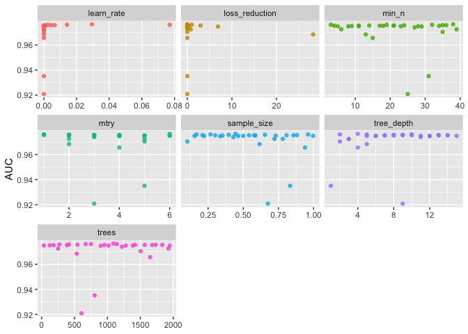

Text and Analysis for in-progress Mountain Rain or Snow Manuscript
================
Keith Jennings
2023-12-07

# What is this?

This sentence you’re reading is probably part of a rendered Markdown
document on GitHub and it’s based on an RMarkdown file I put together to
analyze data for a Mountain Rain or Snow manuscript that explores the
limits of rain-snow partitioning using near-surface meteorology.

# What is this directory?

The directory, for which this document serves as the README, includes
all of the R scripts for tuning and processing rain-snow partitioning
models.

<DETAIL THE FILES>

# Who am I? Why I am here?

# The necessary stuff

``` r
# Load R packages
library(tidyverse)
library(tidymodels)
```

# Supplemental Information

## Hyperparemeter tuning

### Random Forest

``` r
# Load the tuning data
# These are local files (update document if moved)
load("../../../../data/rf_tune_results.rdata")
load("../../../../data/xg_tune_results.rdata")
```

For the random forest model, we found that overall performance was
insensitive to the choice of hyperparameters. First, we randomly
selected 1% of the Jennings et al. dataset (178108 observations) and
used those to run a hyperparameter tuning workflow in the tidymodels R
package. We used two performance metrics to evaluate the models:
accuracy and area under the curve (AUC). The former represents the
proportion of observations correctly predicted and the latter
corresponds to the area under the receiver operating characteristic
curve, which plots the true positive rate against the false positive
rate. Both metrics range from 0 to 1, where 0 equals no observations
correctly predicted and 1 equals all observations correctly predicted.

In this tuning workflow, we provided three mtry values (3, 4, and 5) and
three tree values (100, 300, and 500), giving a total of 9 unique
hyperparameter combinations, which we tested across ten folds of the
data. Within this hyperparameter space, we found almost no variation,
with mean accuracy ranging from 0.924 to 0.924 and mean AUC similarly
ranging from 0.969 to 0.97. The best-performing hyperparameters were
mtry = 5 and trees = 500.

Next, we performed the tuning using all entries from the crowdsourced
precipitation phase dataset in four different scenarios: 1) include
mixed precipitation and only use meteorological variables, 2) exclude
mixed precipitation and only use meteorological variables, 3) include
mixed precipitation and use meteorology plus EPA Level III ecoregions,
and 4) exclude mixed precipitation and use meteorology plus EPA Level
III ecoregions. In each of these four scenarios we found little
sensitivity in the mean accuracy and mean AUC, confirming the results of
the tuning exercise on the northern hemisphere dataset. Mean accuracy
ranged from 0.768 to 0.77 for scenario 1, 0.881 to 0.883 for scenario 2,
0.779 to 0.78 for scenario 3, and 0.891 to 0.892 for scenario 4.
Similarly mean AUC ranged from 0.797 to 0.798 for scenario 1, 0.935 to
0.936 for scenario 2, 0.819 to 0.822 for scenario 3, and 0.944 to 0.945
for scenario 4.

### XGBoost

We also performed hyperparameter tuning on the XGBoost models, which
have a greater number of hyperparameters and thus required a slightly
different tuning approach. Here, instead of prescribing the
hyperparameter values and combinations, we created a 30 element latin
hypercube of the hyperparameter space across ten folds of the data. We
again started with a 1% sample of the Jennings et al. (2018) dataset and
found, at first glance, that output from the XGBoost model appeared to
be more sensitive to hyperparameter values than the random forest (FIG
S#). However, a closer look at the data showed much of the sensitivity
was a result of low learn rate values. For example, if we removed the
lowest learn rate value (1.12e-10), we found the range in mean accuracy
shifted from 0.529–0.932 to 0.931–0.932 and mean AUC shifted from
0.921–0.976 to 0.935–0.976.

``` r
nh_nomix_metonly_xg_tune_results %>%
    filter(.metric == "roc_auc") %>%
    select(mean, mtry:sample_size) %>%
    pivot_longer(mtry:sample_size,
                 values_to = "value",
                 names_to = "parameter"
    ) %>%
    ggplot(aes(value, mean, color = parameter)) +
    geom_point(alpha = 0.8, show.legend = FALSE) +
    facet_wrap(~parameter, scales = "free_x") +
    labs(x = NULL, y = "AUC")
```

<!-- -->

Finally, we performed the XGBoost tuning using the crowdsourced
precipitation phase dataset in the four different scenarios we detailed
in the random forest subsection above. We again used a 30 element latin
hypercube of the hyperparameter space across ten folds of the data. Mean
accuracy ranged from 0.119 to 0.785 for scenario 1, 0.847 to 0.89 for
scenario 2, 0.119 to 0.791 for scenario 3, and 0.696 to 0.895 for
scenario 4. Mean AUC ranged from 0.5 to 0.819 for scenario 1, 0.862 to
0.945 for scenario 2, 0.5 to 0.835 for scenario 3, and 0.89 to 0.95 for
scenario 4.

Notably, low learn rate values drove again drove the wide range in
performance for the XGBoost models. In this case, removing the 8 lowest
learn rate values—out of 30—from the latin hypercube produced much
narrower ranges in mean accuracy and AUC. When only considering learn
rate values greater than 1.67e-8, mean accuracy ranged from 0.776 to
0.785 for scenario 1, 0.877 to 0.89 for scenario 2, 0.619 to 0.791 for
scenario 3, and 0.696 to 0.895 for scenario 4. Similarly mean AUC ranged
from 0.808 to 0.819 for scenario 1, 0.934 to 0.945 for scenario 2, 0.793
to 0.835 for scenario 3, and 0.92 to 0.95 for scenario 4.
