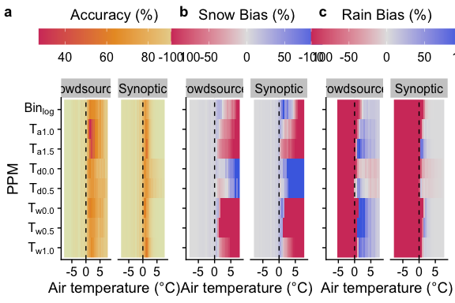
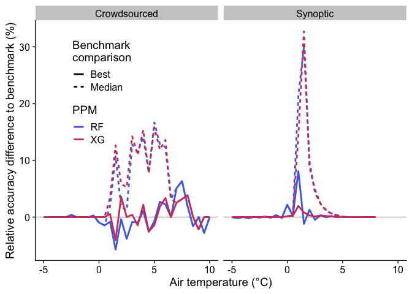
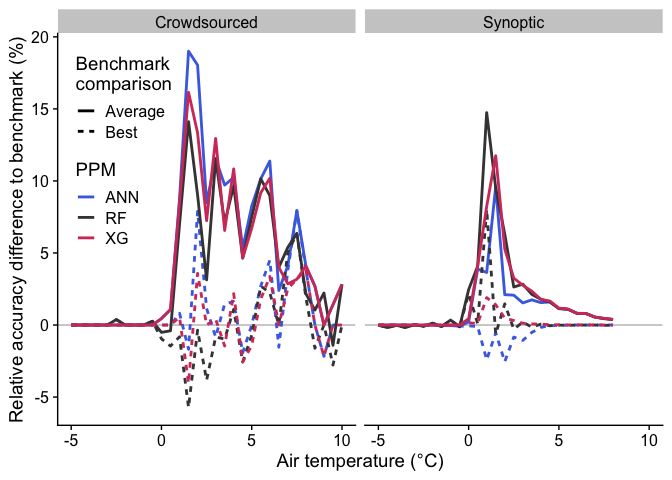
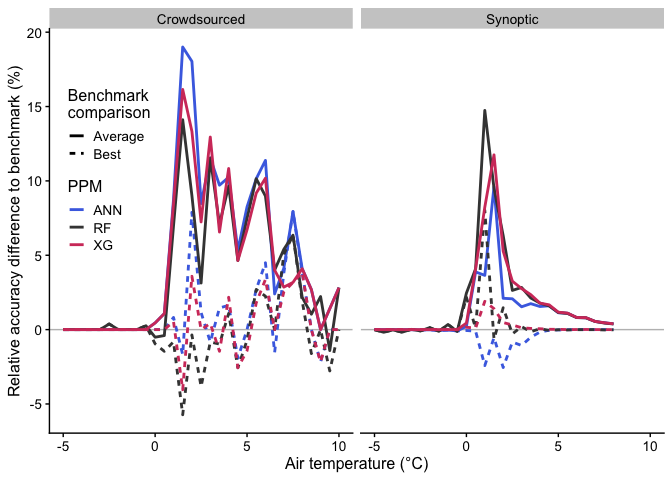
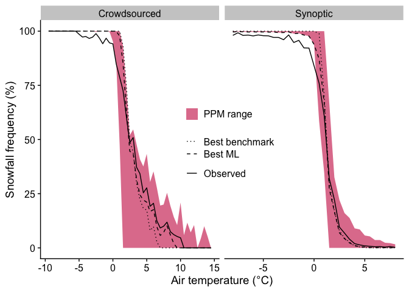
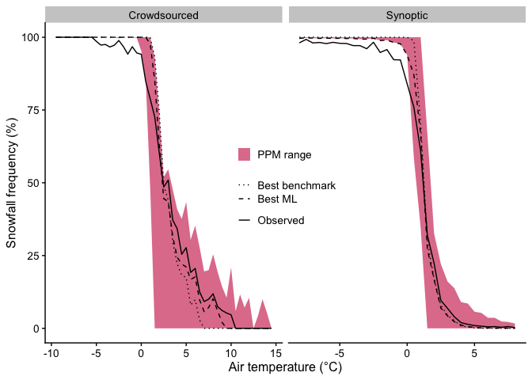
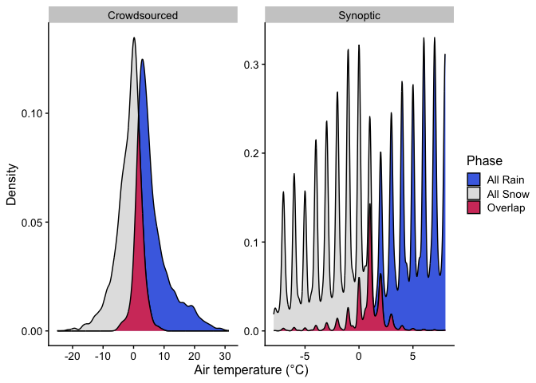

Text and Analysis for in-progress Mountain Rain or Snow Manuscript
================
Keith Jennings
Sys.Date()

# Info

The directory, for which this document serves as the README, includes
all of the R scripts for tuning, processing, and analyzing rain-snow
partitioning models.

<DETAIL THE FILES>

# The necessary stuff

Import the packages we need.

``` r
# Load R packages
library(tidyverse)
library(tidymodels)
library(cowplot); theme_set(theme_cowplot())
```

Import the datasets we need.

``` r
# `cache=TRUE` keeps the data stored and prevents it from being read in anew each time

# Data directory prefix
# Specific to my computer, change before sharing
data_pre <- "../../../../data/"

# Load the results files
# These are local files (update document if moved)
# Also update nh scenario to be "nomix_onlymet"
# And add a source_label for plotting & tables
summary_all <- readRDS(paste0(data_pre, "performance_summary_all.RDS")) %>% 
    mutate(source_lab = ifelse(source == "cs", "Crowdsourced", "Synoptic"))
summary_bytemp <- readRDS(paste0(data_pre, "performance_summary_bytemp.RDS")) %>% 
    mutate(source_lab = ifelse(source == "cs", "Crowdsourced", "Synoptic"))
predictions_all <- readRDS(paste0(data_pre, "predictions_all.RDS"))

# Load the model objects for xgboost and random forest
ml_for_vip <- readRDS(paste0(data_pre, "ml_models_for_vip.RDS"))

# Load the met data for analysis
met <- readRDS(paste0(data_pre, "cs_nh_met_data.RDS"))
```

# Results

## Rain-snow partitioning performance

### Benchmarks

``` r
benchmark_types <- data.frame(ppm = c("binlog","thresh_tdew_0", "thresh_tdew_0.5",
                                      "thresh_twet_0", "thresh_twet_0.5", 
                                      "thresh_twet_1",
                                      "thresh_tair_1", "thresh_tair_1.5",
                                      "rf", "xg"),
                              type = c(rep("humidity", 6), 
                                       rep("tair", 2),
                                       rep("ml", 2)))
summary_all <- left_join(summary_all, benchmark_types, by = "ppm")
```

The benchmark methods exhibited variable performance in predicting rain
versus snow in both the crowdsourced and synoptic datasets (Table 1).
The methods incorporating humidity (e.g., the binary logistic regression
model and the wet bulb and dew point temperature thresholds) generally
performed better than the methods using only air temperature, with a
median accuracy value of 87.5% for the former compared to 81.8% for the
latter. With a median rain bias value of 0.6%, the humidity-based
methods performed markedly better than the air-temperature-only methods
(38.1%). The air-temperature-only methods also had a slightly worse
median snow bias than the humidity methods at -8.8% versus 5.9%.

``` r
# Calculate minimums, maximums, and ranges

# Crowdsourced
# Accuracy
cs_benchmark_accuracy_min = summary_all %>% filter(source == "cs", scenario == "nomix_imbal" & !ppm %in% c("xg", "rf")) %>% pull(accuracy_pct) %>% min() %>% round(digits = 1)
cs_benchmark_accuracy_max = summary_all %>% filter(source == "cs", scenario == "nomix_imbal" & !ppm %in% c("xg", "rf")) %>% pull(accuracy_pct) %>% max() %>% round(digits = 1)
cs_benchmark_accuracy_range = cs_benchmark_accuracy_max - cs_benchmark_accuracy_min
# Snow bias
cs_benchmark_snow_bias_min = summary_all %>% filter(source == "cs", scenario == "nomix_imbal" & !ppm %in% c("xg", "rf")) %>% pull(snow_bias_pct) %>% min() %>% round(digits = 1)
cs_benchmark_snow_bias_max = summary_all %>% filter(source == "cs", scenario == "nomix_imbal" & !ppm %in% c("xg", "rf")) %>% pull(snow_bias_pct) %>% max() %>% round(digits = 1)
cs_benchmark_snow_bias_range = cs_benchmark_snow_bias_max - cs_benchmark_snow_bias_min
# Rain bias
cs_benchmark_rain_bias_min = summary_all %>% filter(source == "cs", scenario == "nomix_imbal" & !ppm %in% c("xg", "rf")) %>% pull(rain_bias_pct) %>% min() %>% round(digits = 1)
cs_benchmark_rain_bias_max = summary_all %>% filter(source == "cs", scenario == "nomix_imbal" & !ppm %in% c("xg", "rf")) %>% pull(rain_bias_pct) %>% max() %>% round(digits = 1)
cs_benchmark_rain_bias_range = cs_benchmark_rain_bias_max - cs_benchmark_rain_bias_min


# Synoptic
nh_benchmark_accuracy_min = summary_all %>% filter(source == "nh", scenario == "nomix_imbal" & !ppm %in% c("xg", "rf")) %>% pull(accuracy_pct) %>% min() %>% round(digits = 1)
nh_benchmark_accuracy_max = summary_all %>% filter(source == "nh", scenario == "nomix_imbal" & !ppm %in% c("xg", "rf")) %>% pull(accuracy_pct) %>% max() %>% round(digits = 1)
nh_benchmark_accuracy_range = nh_benchmark_accuracy_max - nh_benchmark_accuracy_min
# Snow bias
nh_benchmark_snow_bias_min = summary_all %>% filter(source == "nh", scenario == "nomix_imbal" & !ppm %in% c("xg", "rf")) %>% pull(snow_bias_pct) %>% min() %>% round(digits = 1)
nh_benchmark_snow_bias_max = summary_all %>% filter(source == "nh", scenario == "nomix_imbal" & !ppm %in% c("xg", "rf")) %>% pull(snow_bias_pct) %>% max() %>% round(digits = 1)
nh_benchmark_snow_bias_range = nh_benchmark_snow_bias_max - nh_benchmark_snow_bias_min
# Rain bias
nh_benchmark_rain_bias_min = summary_all %>% filter(source == "nh", scenario == "nomix_imbal" & !ppm %in% c("xg", "rf")) %>% pull(rain_bias_pct) %>% min() %>% round(digits = 1)
nh_benchmark_rain_bias_max = summary_all %>% filter(source == "nh", scenario == "nomix_imbal" & !ppm %in% c("xg", "rf")) %>% pull(rain_bias_pct) %>% max() %>% round(digits = 1)
nh_benchmark_rain_bias_range = nh_benchmark_rain_bias_max - nh_benchmark_rain_bias_min
```

When examining the two datasets separately, we found a few key
differences. For example, accuracy was generally lower in the
crowdsourced dataset, ranging from 80.5% to 88.7%, a total spread of
8.2%. That is larger than the accuracy spread of the synoptic dataset
(2.4%), which had a minimum of 90.7% and a maximum of 93.1%. In the
crowdsourced dataset, the top six methods, ranked by accuracy, all used
humidity, while the bottom two relied on air temperature alone. The case
was slightly different for the synoptic dataset where the two dew point
temperature thresholds performed worse than the two static air
temperature thresholds. Snow and rain biases had larger ranges than
accuracy in both datasets. Snow bias varied by 28.5% and 16.8%, while
rain bias varied by 64.4% and 14.8% in the crowdsourced and synoptic
datasets, respectively. In general, the benchmarks performed better and
with less variability when applied to the synoptic dataset, and methods
with better accuracy values typically had lower rain and snow biases.

``` r
summary_all %>% 
    filter(scenario == "nomix_imbal") %>% 
    filter(!ppm %in% c("xg", "rf")) %>% 
    ungroup() %>% 
    arrange(source_lab, -accuracy_pct) %>% 
    mutate(across(where(is.numeric), round, digits = 1)) %>% 
    select(Source = source_lab, 
           PPM = ppm, 
           `Accuracy (%)` = accuracy_pct, 
           `Snow bias (%)` = snow_bias_pct,
           `Rain bias (%)` = rain_bias_pct) %>% 
    knitr::kable()
```

    ## Warning: There was 1 warning in `mutate()`.
    ## ℹ In argument: `across(where(is.numeric), round, digits = 1)`.
    ## Caused by warning:
    ## ! The `...` argument of `across()` is deprecated as of dplyr 1.1.0.
    ## Supply arguments directly to `.fns` through an anonymous function instead.
    ## 
    ##   # Previously
    ##   across(a:b, mean, na.rm = TRUE)
    ## 
    ##   # Now
    ##   across(a:b, \(x) mean(x, na.rm = TRUE))

| Source       | PPM             | Accuracy (%) | Snow bias (%) | Rain bias (%) |
|:-------------|:----------------|-------------:|--------------:|--------------:|
| Crowdsourced | thresh_twet_1   |         88.7 |           4.5 |         -10.2 |
| Crowdsourced | thresh_twet_0.5 |         88.5 |          -3.3 |           7.4 |
| Crowdsourced | thresh_tdew_0.5 |         87.7 |           7.9 |         -17.9 |
| Crowdsourced | thresh_tdew_0   |         87.3 |           0.5 |          -1.1 |
| Crowdsourced | binlog          |         86.3 |          -8.6 |          19.5 |
| Crowdsourced | thresh_twet_0   |         86.1 |         -11.4 |          25.7 |
| Crowdsourced | thresh_tair_1.5 |         83.0 |         -13.2 |          29.7 |
| Crowdsourced | thresh_tair_1   |         80.5 |         -20.6 |          46.5 |
| Synoptic     | thresh_twet_0.5 |         93.1 |           6.2 |          -5.5 |
| Synoptic     | binlog          |         93.1 |           5.6 |          -5.0 |
| Synoptic     | thresh_twet_0   |         92.2 |          -2.7 |           2.3 |
| Synoptic     | thresh_tair_1   |         92.1 |           4.5 |          -4.0 |
| Synoptic     | thresh_tair_1.5 |         91.9 |           8.2 |          -7.2 |
| Synoptic     | thresh_twet_1   |         91.8 |          14.1 |         -12.5 |
| Synoptic     | thresh_tdew_0   |         90.9 |           9.8 |          -8.7 |
| Synoptic     | thresh_tdew_0.5 |         90.7 |          13.5 |         -11.9 |

Table 1. Performance metrics for the benchmark precipitation
partitioning methods (PPMs) using the crowdsourced and synoptic
datasets.

All of the benchmark methods performed worse at air temperatures near
and slightly above the freezing point in terms of accuracy, with most of
them reaching their minimum accuracy values between 1.5°C and 2.0°C in
the crowdsourced dataset and between 0.5°C and 1.5°C in the synoptic
dataset (Figure 3). In both datasets, most methods had slightly positive
snow biases and markedly negative rain biases at air temperatures less
than 1.0°C. This is consistent with their limited, or complete lack of,
ability to predict rain at sub-freezing temperatures. Conversely, most
methods, with the exception of the dew point temperature thresholds, had
largely negative snow biases and slightly positive rain biases at air
temperatures above 2°C. Notably, the crowdsourced dataset expressed
larger positive rain biases at higher temperatures, indicating the
benchmark methods failed to capture snowfall occurring during warm
near-surface conditions.

    ## Warning: Removed 608 rows containing missing values (`geom_raster()`).
    ## Removed 608 rows containing missing values (`geom_raster()`).
    ## Removed 608 rows containing missing values (`geom_raster()`).

<!-- -->

``` r
# Code for minimum accuracy
summary_bytemp %>% filter(source == "cs" & scenario == "nomix_imbal" & !ppm %in% c("rf", "xg")) %>% group_by(ppm) %>% slice_min(accuracy_pct)
```

    ## # A tibble: 8 × 16
    ## # Groups:   ppm [8]
    ##   ppm    scenario source tair_bin     n accuracy_pct snow_bias_pct rain_bias_pct
    ##   <chr>  <chr>    <chr>     <dbl> <int>        <dbl>         <dbl>         <dbl>
    ## 1 binlog nomix_i… cs          1.5   409         61.9        -29.6           78.6
    ## 2 thres… nomix_i… cs          1.5   409         27.4       -100            265. 
    ## 3 thres… nomix_i… cs          2     421         39.7       -100            152. 
    ## 4 thres… nomix_i… cs          1.5   409         64.3        -20.2           53.6
    ## 5 thres… nomix_i… cs          2     421         69.8          7.48         -11.4
    ## 6 thres… nomix_i… cs          1.5   409         61.1        -39.4          104. 
    ## 7 thres… nomix_i… cs          1.5   409         69.7         -6.06          16.1
    ## 8 thres… nomix_i… cs          2     421         66.3         23.6          -35.9
    ## # ℹ 8 more variables: mixed_bias_pct <dbl>, snow_obs_pct <dbl>,
    ## #   rain_obs_pct <dbl>, mixed_obs_pct <dbl>, snow_pred_pct <dbl>,
    ## #   rain_pred_pct <dbl>, mixed_pred_pct <dbl>, source_lab <chr>

``` r
summary_bytemp %>% filter(source == "nh" & scenario == "nomix_imbal" & !ppm %in% c("rf", "xg")) %>% group_by(ppm) %>% slice_min(accuracy_pct)
```

    ## # A tibble: 8 × 16
    ## # Groups:   ppm [8]
    ##   ppm   scenario source tair_bin      n accuracy_pct snow_bias_pct rain_bias_pct
    ##   <chr> <chr>    <chr>     <dbl>  <int>        <dbl>         <dbl>         <dbl>
    ## 1 binl… nomix_i… nh          1   297821         68.7         16.1          -25.1
    ## 2 thre… nomix_i… nh          1   297821         60.7         36.4          -56.8
    ## 3 thre… nomix_i… nh          1.5  60519         55.9         36.9          -17.3
    ## 4 thre… nomix_i… nh          0.5  92281         67.8         -4.77          15.1
    ## 5 thre… nomix_i… nh          1   297821         68.4         17.8          -27.7
    ## 6 thre… nomix_i… nh          1   297821         60.7        -43.1           67.2
    ## 7 thre… nomix_i… nh          1   297821         68.7         15.6          -24.3
    ## 8 thre… nomix_i… nh          1.5  60519         59.0        109.           -51.3
    ## # ℹ 8 more variables: mixed_bias_pct <dbl>, snow_obs_pct <dbl>,
    ## #   rain_obs_pct <dbl>, mixed_obs_pct <dbl>, snow_pred_pct <dbl>,
    ## #   rain_pred_pct <dbl>, mixed_pred_pct <dbl>, source_lab <chr>

### Machine learning methods

``` r
cols_to_get = c("source", "ppm", "accuracy_pct", "snow_bias_pct", "rain_bias_pct")


cs_best_benchmark = summary_all %>% 
    filter(source == "cs" & !ppm %in% c("xg", "rf") & scenario == "nomix_imbal") %>% 
    ungroup() %>% 
    slice_max(accuracy_pct, n = 1) %>% 
    pull(ppm)

cs_median_benchmark = summary_all %>% 
    filter(source == "cs" & !ppm %in% c("xg", "rf") & scenario == "nomix_imbal") %>% 
    ungroup() %>% 
    arrange(-accuracy_pct) %>% 
    slice(5) %>% 
    pull(ppm)

cs_benchmark_diff <- summary_all %>% 
    filter(source == "cs" & ppm %in% c("xg", "rf") & scenario == "nomix_imbal") %>% 
    select(cols_to_get) %>% 
    bind_cols(.,summary_all %>% 
                  filter(source == "cs" & ppm == cs_best_benchmark & scenario == "nomix_imbal") %>% 
                  select(cols_to_get)) %>% 
    bind_rows(., summary_all %>% 
    filter(source == "cs" & ppm %in% c("xg", "rf") & scenario == "nomix_imbal") %>% 
    select(cols_to_get) %>% 
    bind_cols(.,summary_all %>% 
                  filter(source == "cs" & ppm == cs_median_benchmark & scenario == "nomix_imbal") %>% 
                  select(cols_to_get)))
```

    ## Warning: Using an external vector in selections was deprecated in tidyselect 1.1.0.
    ## ℹ Please use `all_of()` or `any_of()` instead.
    ##   # Was:
    ##   data %>% select(cols_to_get)
    ## 
    ##   # Now:
    ##   data %>% select(all_of(cols_to_get))
    ## 
    ## See <https://tidyselect.r-lib.org/reference/faq-external-vector.html>.
    ## This warning is displayed once every 8 hours.
    ## Call `lifecycle::last_lifecycle_warnings()` to see where this warning was
    ## generated.

    ## Adding missing grouping variables: `scenario`
    ## Adding missing grouping variables: `scenario`
    ## New names:
    ## Adding missing grouping variables: `scenario`
    ## Adding missing grouping variables: `scenario`
    ## New names:

``` r
nh_best_benchmark = "binlog"

nh_median_benchmark = summary_all %>% 
    filter(source == "nh" & !ppm %in% c("xg", "rf") & scenario == "nomix_imbal") %>% 
    ungroup() %>% 
    arrange(-accuracy_pct) %>% 
    slice(5) %>% 
    pull(ppm)

nh_benchmark_diff <- summary_all %>% 
    filter(source == "nh" & ppm %in% c("xg", "rf") & scenario == "nomix_imbal") %>% 
    select(cols_to_get) %>% 
    bind_cols(.,summary_all %>% 
                  filter(source == "nh" & ppm == nh_best_benchmark & scenario == "nomix_imbal") %>% 
                  select(cols_to_get)) %>% 
    bind_rows(., summary_all %>% 
    filter(source == "nh" & ppm %in% c("xg", "rf") & scenario == "nomix_imbal") %>% 
    select(cols_to_get) %>% 
    bind_cols(.,summary_all %>% 
                  filter(source == "nh" & ppm == nh_median_benchmark & scenario == "nomix_imbal") %>% 
                  select(cols_to_get)))
```

    ## Adding missing grouping variables: `scenario`
    ## Adding missing grouping variables: `scenario`
    ## New names:
    ## Adding missing grouping variables: `scenario`
    ## Adding missing grouping variables: `scenario`
    ## New names:

``` r
ml_benchmark_diff <- bind_rows(cs_benchmark_diff, nh_benchmark_diff) %>% 
    mutate(comparison = rep(c("best", "best", "med", "med"), 2)) %>% 
    select(-scenario...1,
           source = source...2,
           ppm = ppm...3,
           comparison,
           ml_accuracy_pct = accuracy_pct...4,
           ml_snow_bias_pct = snow_bias_pct...5,
           ml_rain_bias_pct = rain_bias_pct...6,
           bm_accuracy_pct = accuracy_pct...10,
           bm_snow_bias_pct = snow_bias_pct...11,
           bm_rain_bias_pct = rain_bias_pct...12,
           -scenario...7, -source...8, -ppm...9) %>% 
    mutate(accuracy_pct_diff = ml_accuracy_pct - bm_accuracy_pct,
           snow_bias_abs_pct_diff = abs(ml_snow_bias_pct) - abs(bm_snow_bias_pct),
           rain_bias_abs_pct_diff = abs(ml_rain_bias_pct) - abs(bm_rain_bias_pct))

# Make a table
ml_benchmark_diff %>% 
    select(source, ppm, comparison,
           ml_accuracy_pct, accuracy_pct_diff,
           ml_snow_bias_pct, snow_bias_abs_pct_diff,
           ml_rain_bias_pct, rain_bias_abs_pct_diff) %>% 
    mutate(across(where(is.numeric), round, digits = 1)) %>% 
    knitr::kable()
```

| source | ppm | comparison | ml_accuracy_pct | accuracy_pct_diff | ml_snow_bias_pct | snow_bias_abs_pct_diff | ml_rain_bias_pct | rain_bias_abs_pct_diff |
|:---|:---|:---|---:|---:|---:|---:|---:|---:|
| cs | rf | best | 88.3 | -0.4 | 3.5 | -1.0 | -7.9 | -2.3 |
| cs | xg | best | 88.8 | 0.1 | 4.7 | 0.2 | -10.6 | 0.4 |
| cs | rf | med | 88.3 | 2.0 | 3.5 | -5.1 | -7.9 | -11.6 |
| cs | xg | med | 88.8 | 2.4 | 4.7 | -3.9 | -10.6 | -8.9 |
| nh | rf | best | 93.7 | 0.6 | 3.6 | -2.0 | -3.2 | -1.8 |
| nh | xg | best | 93.3 | 0.2 | 5.4 | -0.2 | -4.8 | -0.2 |
| nh | rf | med | 93.7 | 1.8 | 3.6 | -4.5 | -3.2 | -4.0 |
| nh | xg | med | 93.3 | 1.4 | 5.4 | -2.7 | -4.8 | -2.4 |

The two machine learning methods, random forest and XGBoost, generally
provided small performance gains relative to the best benchmark methods
and large, consistent improvements relative to the median benchmark
methods (Table 3). In the crowdsourced dataset, XGBoost had a negligibly
higher accuracy (88.8%) than T<sub>w1.0</sub> (88.7%), while random
forest had a slightly lower accuracy (88.3%) than the T<sub>w1.0</sub>
threshold, which was the best performing method from the benchmark
exercise. Both XGBoost (93.3%) and random forest (93.7%) provided
marginal improvements relative to T<sub>w0.5</sub> (93.1%) and
Bin<sub>log</sub> (93.1%), the best PPMs in the synoptic dataset as
measured by the accuracy metric.

``` r
# Code for minimum accuracy
summary_bytemp %>% filter(source == "cs" & scenario == "nomix_imbal" & ppm %in% c("rf", "xg")) %>% group_by(ppm) %>% slice_min(accuracy_pct)
```

    ## # A tibble: 2 × 16
    ## # Groups:   ppm [2]
    ##   ppm   scenario  source tair_bin     n accuracy_pct snow_bias_pct rain_bias_pct
    ##   <chr> <chr>     <chr>     <dbl> <int>        <dbl>         <dbl>         <dbl>
    ## 1 rf    nomix_im… cs            2   421         66.0          5.12         -7.78
    ## 2 xg    nomix_im… cs            2   421         68.6         12.6         -19.2 
    ## # ℹ 8 more variables: mixed_bias_pct <dbl>, snow_obs_pct <dbl>,
    ## #   rain_obs_pct <dbl>, mixed_obs_pct <dbl>, snow_pred_pct <dbl>,
    ## #   rain_pred_pct <dbl>, mixed_pred_pct <dbl>, source_lab <chr>

``` r
summary_bytemp %>% filter(source == "nh" & scenario == "nomix_imbal" & ppm %in% c("rf", "xg")) %>% group_by(ppm) %>% slice_min(accuracy_pct)
```

    ## # A tibble: 2 × 16
    ## # Groups:   ppm [2]
    ##   ppm   scenario source tair_bin      n accuracy_pct snow_bias_pct rain_bias_pct
    ##   <chr> <chr>    <chr>     <dbl>  <int>        <dbl>         <dbl>         <dbl>
    ## 1 rf    nomix_i… nh            1 297821         74.2          9.77         -15.2
    ## 2 xg    nomix_i… nh            1 297821         70.0         12.7          -19.8
    ## # ℹ 8 more variables: mixed_bias_pct <dbl>, snow_obs_pct <dbl>,
    ## #   rain_obs_pct <dbl>, mixed_obs_pct <dbl>, snow_pred_pct <dbl>,
    ## #   rain_pred_pct <dbl>, mixed_pred_pct <dbl>, source_lab <chr>

``` r
# Code for minimum accuracy
summary_bytemp %>% filter(source == "cs" & scenario == "nomix_imbal" & ppm %in% c("rf", "xg")) %>% group_by(ppm) %>% slice_min(accuracy_pct)
```

    ## # A tibble: 2 × 16
    ## # Groups:   ppm [2]
    ##   ppm   scenario  source tair_bin     n accuracy_pct snow_bias_pct rain_bias_pct
    ##   <chr> <chr>     <chr>     <dbl> <int>        <dbl>         <dbl>         <dbl>
    ## 1 rf    nomix_im… cs            2   421         66.0          5.12         -7.78
    ## 2 xg    nomix_im… cs            2   421         68.6         12.6         -19.2 
    ## # ℹ 8 more variables: mixed_bias_pct <dbl>, snow_obs_pct <dbl>,
    ## #   rain_obs_pct <dbl>, mixed_obs_pct <dbl>, snow_pred_pct <dbl>,
    ## #   rain_pred_pct <dbl>, mixed_pred_pct <dbl>, source_lab <chr>

``` r
summary_bytemp %>% filter(source == "nh" & scenario == "nomix_imbal" & ppm %in% c("rf", "xg")) %>% group_by(ppm) %>% slice_min(accuracy_pct)
```

    ## # A tibble: 2 × 16
    ## # Groups:   ppm [2]
    ##   ppm   scenario source tair_bin      n accuracy_pct snow_bias_pct rain_bias_pct
    ##   <chr> <chr>    <chr>     <dbl>  <int>        <dbl>         <dbl>         <dbl>
    ## 1 rf    nomix_i… nh            1 297821         74.2          9.77         -15.2
    ## 2 xg    nomix_i… nh            1 297821         70.0         12.7          -19.8
    ## # ℹ 8 more variables: mixed_bias_pct <dbl>, snow_obs_pct <dbl>,
    ## #   rain_obs_pct <dbl>, mixed_obs_pct <dbl>, snow_pred_pct <dbl>,
    ## #   rain_pred_pct <dbl>, mixed_pred_pct <dbl>, source_lab <chr>

``` r
ml_benchmark_diff_bytemp <- bind_rows(
  summary_bytemp %>% 
    filter(source == "cs" & scenario == "nomix_imbal") %>% 
    pivot_wider(names_from = ppm, values_from = accuracy_pct, id_cols = tair_bin) %>% 
    mutate(rf_best = (rf-thresh_twet_1)/thresh_twet_1*100,
           rf_med = (rf-binlog)/binlog*100,
           xg_best = (xg-thresh_twet_1)/thresh_twet_1*100,
           xg_med = (xg-binlog)/binlog*100) %>% 
    select(tair_bin, rf_best:xg_med) %>% 
    pivot_longer(cols = rf_best:xg_med,
                 names_to = c("ppm", "benchmark"),
                 names_pattern = "(.*)_(.*)",
                 values_to = "accuracy_diff_rel_pct") %>% 
    mutate(source_lab = "Crowdsourced", source = "cs"),
  summary_bytemp %>% 
    filter(source == "nh" & scenario == "nomix_imbal") %>% 
    pivot_wider(names_from = ppm, values_from = accuracy_pct, id_cols = tair_bin) %>% 
    mutate(rf_best = (rf-binlog)/binlog*100,
           rf_med = (rf-thresh_twet_1)/thresh_twet_1*100,
           xg_best = (xg-binlog)/binlog*100,
           xg_med = (xg-thresh_twet_1)/thresh_twet_1*100) %>% 
    select(tair_bin, rf_best:xg_med) %>% 
    pivot_longer(cols = rf_best:xg_med,
                 names_to = c("ppm", "benchmark"),
                 names_pattern = "(.*)_(.*)",
                 values_to = "accuracy_diff_rel_pct") %>% 
    mutate(source_lab = "Synoptic", source = "nh")
)

ml_benchmark_rel_diff_plot <- 
  ggplot() +
  geom_hline(yintercept = 0, color = "grey") +
  geom_line(data = ml_benchmark_diff_bytemp, lwd = 1, 
            aes(tair_bin, accuracy_diff_rel_pct, color = ppm, lty = benchmark)) +
  scale_color_manual(values =  hcl.colors(2, "Blue-Red2"),
                     labels = c("RF", "XG"),
                     name = "PPM")+
  scale_linetype_discrete(labels = c("Best", "Median"),
                          name = "Benchmark\ncomparison") +
  labs(x = "Air temperature (°C)", 
       y = "Relative accuracy difference to benchmark (%)") +
  xlim(c(-5,10)) +
  theme(legend.position = c(0.1,0.7)) +
  facet_wrap(~source_lab)
ml_benchmark_rel_diff_plot
```

    ## Warning: Removed 24 rows containing missing values (`geom_line()`).

<!-- -->

``` r
save_plot(filename = "figures/fig04_ml_benchmark_rel_diff.png", 
          plot = ml_benchmark_rel_diff_plot, 
          base_height = 5, 
          base_width = 9)
```

    ## Warning: Removed 24 rows containing missing values (`geom_line()`).

The two machine learning methods exhibited similar accuracy patterns by
air temperature as the best and median benchmark methods, with
performance degrading at air temperatures slightly above freezing. Both
random forest and XGBoost achieved their minimum success rates of 66%
and 68.6%, respectively, at 2°C in the crowdsourced dataset. Performance
was higher in the synoptic dataset with minimum accuracy values of 74.2%
for random forest and 70% for XGBoost. Both minima occurred at 1°C in
the synoptic dataset. Relative improvements in accuracy compared to the
best and median benchmarks varied by temperature for the machine
learning methods (Figure 4). In the crowdsourced dataset, relative
improvements reached a maximum of 6.3% at 7.5°C compared to the best
benchmark and a maximum of 16.7% at 5°C compared to the median
benchmark. In the synoptic dataset relative improvements were smaller
for the best benchmark comparison, with a max increase of 8.1% at 1°C,
and larger for the median benchmark, with a max increase of 32.7% at
1.5°C.

When compared to the snow and rain biases produced by the best and
median benchmark methods, the machine learning methods provided larger
absolute improvements than those recorded for accuracy (Table YYYY).
While accuracy improvements were all less than or equal to 2.4%, the
reduction in snow bias maxed out at -5.1% and -4.5% in the crowdsourced
and synoptic datasets, respectively. Random forest and XGBoost provided
an even larger improvement in rain bias in the crowdsourced dataset with
a maximum reduction of -11.6%. Conversely, the rain bias reduction was
slightly smaller than the snow bias reduction in the synoptic dataset at
-4%. These results show that while accuracy improvements from the
machine learning methods may be small, random forest and XGBoost predict
rain and snow with lower biases than the benchmark methods.

## Mixed precipitation

Until this point, we have only considered precipitation in its solid and
liquid forms. While the synoptic dataset does not include any mixed
precipitation observations, the testing split of the crowdsourced
dataset includes 1140 observations, comprising 11.8% of the total. As
noted in the methods section, we do not include any dual-threshold
benchmark methods because of their poor historical performance. The
machine learning methods analyzed here fared little better. Including
the mixed observations caused overall accuracy to markedly decline,
going from 88.3% (rain and snow only) to 77.5% (rain, snow, and mixed)
for random forest and from 88.8% (rain and snow only) to 79.2% (rain,
snow, and mixed) for XGBoost.

Although XGBoost had a higher accuracy than random forest when we
included mixed precipitation, it achieved this result at the expense of
bias. The random forest method predicted that 4.3% of the observations
were mixed, which was well short of the observed value of 11.8%, giving
it a mixed bias of -63.9%. XGBoost fared even worse, predicting 0% of
the observations to be mixed, giving it a mixed bias of -100%. When
including mixed precipitation, random forest had a lower snow bias
(12.2%) than XGBoost (16.1%). It was the same story for rain bias with
XGBoost (7.3%) having a worse bias than random forest (0.4%). These
findings appear even worse when viewing the confusion matrix in Figure
5. This plot shows that random forest correctly predicted only 9.3% of
the observed mixed precipitation and incorrectly predicted the mixed
observations as rain 32.9% of the time and as snow the remaining 57.8%.
XGBoost failed completely here, correctly predicting none of the mixed
precipitation observations, identifying them as rain and snow 36.8% and
63.2% of the time, respectively.

``` r
# Get the mixed predictions
mixed_preds <- predictions_all %>%
  filter(scenario == "allphase_imbal" & ppm %in% c("rf", "xg")) %>% 
  mutate(phase_factor = as.factor(phase),
         phase_pred_factor = as.factor(phase_pred))

# Make a confusion matrix
mixed_conf_matrix_plot <- 
  bind_rows(
    mixed_preds %>% filter(ppm == "xg") %>%
      select(phase_pred_factor, phase_factor) %>%
      table() %>%
      prop.table(2) %>%
      as.data.frame() %>%
      mutate(ppm_lab = "XGBoost"),
    mixed_preds %>% filter(ppm == "rf") %>%
      select(phase_pred_factor, phase_factor) %>%
      table() %>%
      prop.table(2) %>%
      as.data.frame() %>%
      mutate(ppm_lab = "Random forest"),
  ) %>%
  ggplot(aes(phase_factor, phase_pred_factor, fill = Freq*100)) +
  geom_tile() +
  geom_text(aes(label = round(Freq * 100, digits = 1))) +
    scale_fill_gradientn(colors = hcl.colors(3, "Heat2"),
                         name = "Frequency (%)") +
  #scale_fill_gradient(low="honeydew1", high="#009194", name = "Frequency\n(%)") +
  labs(x = "Observed", y = "Predicted") +
  scale_x_discrete(labels = c("Mixed", "Rain", "Snow")) +
  scale_y_discrete(labels = c("Mixed", "Rain", "Snow")) +
  facet_wrap(~ppm_lab) 

mixed_conf_matrix_plot
```

<!-- -->

``` r
save_plot(filename = "figures/fig05_mixed_conf_matrix.png", 
          plot = mixed_conf_matrix_plot, 
          base_height = 5, 
          base_width = 9)
```

## Meteorology and snow frequency analysis

``` r
frequency_data <- 
  bind_rows(
    summary_bytemp %>% 
      filter(scenario == "nomix_imbal" & tair_bin < 15 & tair_bin > -10) %>% 
      group_by(tair_bin, source) %>% 
      summarize(snow_pred_pct_min = min(snow_pred_pct),
                snow_pred_pct_max = max(snow_pred_pct),
                snow_pred_pct_avg = mean(snow_pred_pct), 
                snow_obs_pct = mean(snow_obs_pct),
                rain_pred_pct_min = min(rain_pred_pct),
                rain_pred_pct_max = max(rain_pred_pct),
                rain_pred_pct_avg = mean(rain_pred_pct), 
                rain_obs_pct = mean(rain_obs_pct)) %>% 
      mutate(snow_pred_diff = snow_pred_pct_max - snow_pred_pct_min,
             rain_pred_diff = rain_pred_pct_max - rain_pred_pct_min),
    summary_bytemp %>% 
      filter(scenario == "nomix_imbal" & tair_bin < 15 & tair_bin > -10) %>% 
      filter(ppm == "xg" & source == "cs" | ppm == "thresh_twet_1" & source == "cs" |
               ppm == "rf" & source == "nh" | ppm == "thresh_twet_0.5" & source == "nh") %>% 
      select(ppm, source, snow_pred_pct, rain_pred_pct, tair_bin) %>% 
      mutate(type = ifelse(source == "cs",
                           ifelse(ppm == "xg",
                                  "Machine learning",
                                  "Benchmark"),
                           ifelse(ppm == "rf",
                                  "Machine learning",
                                  "Benchmark")))
  ) %>% 
  mutate(source_lab = ifelse(source == "cs",
                             "Crowdsourced",
                             "Synoptic"),
         dummy = "dummy")
```

    ## `summarise()` has grouped output by 'tair_bin'. You can override using the
    ## `.groups` argument.
    ## Adding missing grouping variables: `scenario`

``` r
snowfall_freq_plot <- 
  ggplot() +
  geom_ribbon(data = filter(frequency_data, !is.na(snow_pred_pct_min) & !is.na(snow_pred_pct_max)),
              aes(tair_bin, ymin = snow_pred_pct_min, ymax = snow_pred_pct_max, fill = dummy), alpha = 0.7) +
  geom_line(data = filter(frequency_data, !is.na(snow_pred_pct)), 
            aes(tair_bin, snow_pred_pct, lty = type)) +
  geom_line(data = filter(frequency_data, !is.na(snow_obs_pct)), 
            aes(tair_bin, snow_obs_pct, color = dummy)) +
  scale_linetype_manual(values = c("dotted", "dashed"), name = "",
                        labels = c("Best benchmark", "Best ML")) + 
  scale_fill_manual(name = element_blank(), labels = "PPM range", values = 
                      "#d33f6a") +
  scale_color_manual(name = element_blank(), labels = "Observed", values = "black") +
  theme(legend.position = c(0.4, 0.5),
        legend.spacing.y = unit(-0.05, "cm")) +
  labs(x = "Air temperature (°C)", y = "Snowfall frequency (%)") + 
  facet_wrap(~source_lab, scales = "free_x")
  
snowfall_freq_plot
```

<!-- -->

``` r
save_plot(filename = "figures/fig06_snowfall_freq.png", 
          plot = snowfall_freq_plot, 
          base_height = 4, 
          base_width = 9)


subzero_freq <- met %>% 
  filter(tair <= 0 & scenario == "nomix_imbal") %>% 
  group_by(source) %>% 
  summarize(n_rain = sum(phase == "rain"),
            n_snow = sum(phase == "snow"),
            n_all = n()) %>% 
  mutate(rain_pct = round(n_rain/n_all * 100, digits = 1))
```

In this section, we return our focus to the predictions of only rain and
snow given the poor mixed phase results. Our first consideration is
whether the benchmark and machine learning methods match observed
snowfall frequency curves. A couple patterns emerge from Figure 6. One,
all phase partitioning methods fail to capture the sub-freezing rainfall
events observed in both datasets. Although rainfall comprises a small
proportion of total precipitation below 0°C in the crowdsourced (2.5%)
and synoptic (5.7%) datasets, these observations explain the rain biases
approaching -100% shown in Figure 2 to the left of the 0°C isotherm.
Two, the spreads between the minimum and maximum snowfall frequencies
predicted by all of the phase partitioning methods (blue shading in
Figure 6) approach their largest values at air temperatures slightly
above 0°C. The largest difference (93.2%) occurs at 1.5°C in the
crowdsourced dataset, which is the same temperature at which the
synoptic dataset expresses its largest difference (66.9%).

``` r
# Compute a whole mess of distributions and their overlaps

############################
# Crowdsourced data, no mix
met.tmp <- met %>% filter(source == "cs" & scenario == "nomix_imbal")

# By tair
cs_nomix_tair_snow_dens <- with(met.tmp, density(tair[phase == "snow"], 
                           from = min(tair), 
                           to = max(tair)))
cs_nomix_tair_rain_dens <- with(met.tmp, density(tair[phase == "rain"], 
                           from = min(tair), 
                           to = max(tair)))
cs_nomix_tair_snowrain_joint <- pmin(cs_nomix_tair_snow_dens$y, cs_nomix_tair_rain_dens$y)
cs_nomix_tair_snowrain_overlap = (sum(cs_nomix_tair_snowrain_joint)/sum(cs_nomix_tair_snow_dens$y) +
                           sum(cs_nomix_tair_snowrain_joint)/sum(cs_nomix_tair_rain_dens$y))/2


# By twet
cs_nomix_twet_snow_dens <- with(met.tmp, density(twet[phase == "snow"], 
                           from = min(twet), 
                           to = max(twet)))
cs_nomix_twet_rain_dens <- with(met.tmp, density(twet[phase == "rain"], 
                           from = min(twet), 
                           to = max(twet)))
cs_nomix_twet_snowrain_joint <- pmin(cs_nomix_twet_snow_dens$y, cs_nomix_twet_rain_dens$y)
cs_nomix_twet_snowrain_overlap = (sum(cs_nomix_twet_snowrain_joint)/sum(cs_nomix_twet_snow_dens$y) +
                           sum(cs_nomix_twet_snowrain_joint)/sum(cs_nomix_twet_rain_dens$y))/2

############################
# Synoptic data, no mix
met.tmp <- met %>% filter(source == "nh" & scenario == "nomix_imbal")

# By tair
nh_nomix_tair_snow_dens <- with(met.tmp, density(tair[phase == "snow"], 
                           from = min(tair), 
                           to = max(tair)))
nh_nomix_tair_rain_dens <- with(met.tmp, density(tair[phase == "rain"], 
                           from = min(tair), 
                           to = max(tair)))
nh_nomix_tair_snowrain_joint <- pmin(nh_nomix_tair_snow_dens$y, nh_nomix_tair_rain_dens$y)
nh_nomix_tair_snowrain_overlap = (sum(nh_nomix_tair_snowrain_joint)/sum(nh_nomix_tair_snow_dens$y) +
                           sum(nh_nomix_tair_snowrain_joint)/sum(nh_nomix_tair_rain_dens$y))/2


# By twet
nh_nomix_twet_snow_dens <- with(met.tmp, density(twet[phase == "snow"], 
                           from = min(twet), 
                           to = max(twet)))
nh_nomix_twet_rain_dens <- with(met.tmp, density(twet[phase == "rain"], 
                           from = min(twet), 
                           to = max(twet)))
nh_nomix_twet_snowrain_joint <- pmin(nh_nomix_twet_snow_dens$y, nh_nomix_twet_rain_dens$y)
nh_nomix_twet_snowrain_overlap = (sum(nh_nomix_twet_snowrain_joint)/sum(nh_nomix_twet_snow_dens$y) +
                           sum(nh_nomix_twet_snowrain_joint)/sum(nh_nomix_twet_rain_dens$y))/2


############################
# Crowdsourced data, no mix, 0 to 4°C temp range
met.tmp <- met %>% filter(source == "cs" & scenario == "nomix_imbal" & tair >= 0 & tair <= 4)

# By tair
cs_nomix_tair_04_snow_dens <- with(met.tmp, density(tair[phase == "snow"], 
                           from = min(tair), 
                           to = max(tair)))
cs_nomix_tair_04_rain_dens <- with(met.tmp, density(tair[phase == "rain"], 
                           from = min(tair), 
                           to = max(tair)))
cs_nomix_tair_04_snowrain_joint <- pmin(cs_nomix_tair_04_snow_dens$y, cs_nomix_tair_04_rain_dens$y)
cs_nomix_tair_04_snowrain_overlap = (sum(cs_nomix_tair_04_snowrain_joint)/sum(cs_nomix_tair_04_snow_dens$y) +
                           sum(cs_nomix_tair_04_snowrain_joint)/sum(cs_nomix_tair_04_rain_dens$y))/2

############################
# Synoptic data, no mix, 0 to 4°C temp range
met.tmp <- met %>% filter(source == "nh" & scenario == "nomix_imbal" & tair >= 0 & tair <= 4)

# By tair
nh_nomix_tair_04_snow_dens <- with(met.tmp, density(tair[phase == "snow"], 
                           from = min(tair), 
                           to = max(tair)))
nh_nomix_tair_04_rain_dens <- with(met.tmp, density(tair[phase == "rain"], 
                           from = min(tair), 
                           to = max(tair)))
nh_nomix_tair_04_snowrain_joint <- pmin(nh_nomix_tair_04_snow_dens$y, nh_nomix_tair_04_rain_dens$y)
nh_nomix_tair_04_snowrain_overlap = (sum(nh_nomix_tair_04_snowrain_joint)/sum(nh_nomix_tair_04_snow_dens$y) +
                           sum(nh_nomix_tair_04_snowrain_joint)/sum(nh_nomix_tair_04_rain_dens$y))/2
```

``` r
# Make a plot of the density overlaps
distros_combined <- bind_rows(
  data.frame(temp = rep(cs_nomix_tair_snow_dens$x, 3), 
             density = c(cs_nomix_tair_snow_dens$y, cs_nomix_tair_rain_dens$y, cs_nomix_tair_snowrain_joint),
             type = rep(c("All Snow", "All Rain", "Overlap"), each = length(cs_nomix_tair_snow_dens$x)),
             source = "cs",
             temp_type = "Air Temp."),
  data.frame(temp = rep(cs_nomix_twet_snow_dens$x, 3), 
             density = c(cs_nomix_twet_snow_dens$y, cs_nomix_twet_rain_dens$y, cs_nomix_twet_snowrain_joint),
             type = rep(c("All Snow", "All Rain", "Overlap"), each = length(cs_nomix_twet_snow_dens$x)),
             source = "cs",
             temp_type = "Wet Bulb"),
  data.frame(temp = rep(nh_nomix_tair_snow_dens$x, 3), 
             density = c(nh_nomix_tair_snow_dens$y, nh_nomix_tair_rain_dens$y, nh_nomix_tair_snowrain_joint),
             type = rep(c("All Snow", "All Rain", "Overlap"), each = length(nh_nomix_tair_snow_dens$x)),
             source = "nh",
             temp_type = "Air Temp."),
  data.frame(temp = rep(nh_nomix_twet_snow_dens$x, 3), 
             density = c(nh_nomix_twet_snow_dens$y, nh_nomix_twet_rain_dens$y, nh_nomix_twet_snowrain_joint),
             type = rep(c("All Snow", "All Rain", "Overlap"), each = length(nh_nomix_twet_snow_dens$x)),
             source = "nh",
             temp_type = "Wet Bulb")
) %>% 
  mutate(source_lab = ifelse(source == "cs",
                             "Crowdsourced", "Synoptic"))

density_overlap_plot<- 
  distros_combined %>% 
  filter(temp_type == "Air Temp.") %>% 
  ggplot(aes(temp, density, fill = type), alpha = 0.8) +
  geom_area(position = position_identity(), color = "black") +
  scale_fill_manual(values = hcl.colors(3, "Blue-Red2"),
                         name = "Phase") + 
  labs(x = "Air temperature (°C)", y = "Density") +
  facet_wrap(~source_lab, scales = "free")

density_overlap_plot
```

<!-- -->

``` r
save_plot(filename = "figures/fig07_density_overlap.png", 
          plot = density_overlap_plot, 
          base_height = 4, 
          base_width = 9)
```

If we investigate the observed air temperature distributions of rain and
snow, we find that the largest ranges in snowfall frequency predicted by
the different methods (Figure 6) correspond roughly to the air
temperatures with the greatest degree of overlap in rain and snow
occurrence. Specifically, there is a 33.7% overlap in the distributions
of rain and snow as plotted by air temperature in the crowdsourced
dataset and a 16% overlap in the synoptic dataset. The maximum overlaps
of the rain and snow distributions occur at 1.6°C and 1°C in the
crowdsourced and synoptic datasets, respectively. What’s more, if we
only examine the 0°C-4°C range of poor performance, we find an
astonishing 66.7% overlap in the crowdsourced dataset and 39.7% in the
synoptic dataset. In other words, the air temperature characteristics of
the two phases are nearly indistinguishable between 0°C and 4°C.

``` r
# Get the overlapped data and summarize by air temperature bin
overlap_dens_tair <- distros_combined %>% 
  filter(temp_type == "Air Temp." & type == "Overlap")
overlap_dens_tair_binned <- overlap_dens_tair %>% 
  mutate(tair_bin = round(temp/0.5) * 0.5) %>% 
  group_by(tair_bin, source_lab, source) %>% 
  summarise(density_av = mean(density)) 
```

    ## `summarise()` has grouped output by 'tair_bin', 'source_lab'. You can override
    ## using the `.groups` argument.

``` r
# Get avg accuracy from all methods
accuracy_av_bytemp <- summary_bytemp %>% 
  filter(scenario == "nomix_imbal") %>% 
  group_by(tair_bin, source) %>% 
  summarize(accuracy_av_pct = mean(accuracy_pct))
```

    ## `summarise()` has grouped output by 'tair_bin'. You can override using the
    ## `.groups` argument.

``` r
# Join accuracy to overlap density
overlap_dens_tair_binned <- left_join(overlap_dens_tair_binned,
                                      accuracy_av_bytemp,
                                      by = c("tair_bin", "source"))

# Plot
overlap_accuracy_relationship_plot <- 
  plot_grid(
  plot_grid(
    ggplot(overlap_dens_tair_binned, aes(tair_bin, accuracy_av_pct, color = source_lab)) + 
      geom_line() +
      labs(y = "Average\naccuracy (%)") +
      theme(axis.title.x = element_blank(),
          axis.text.x = element_blank(),
          legend.position = "none") +
      scale_color_manual(name = "Source", values = hcl.colors(2, "Blue-Red2")),
    ggplot(overlap_dens_tair_binned, aes(tair_bin, density_av, color = source_lab)) +
      geom_line() +
      labs(x = "Air temperature (°C)",
          y = "Overlap\ndensity") +
      theme(legend.position = "none")+ 
      scale_color_manual(name = "Source", values = hcl.colors(2, "Blue-Red2")),
  ncol = 1, align = "vh", labels = "auto"
  ),
  ggplot(overlap_dens_tair_binned, aes(density_av, accuracy_av_pct, 
                                       color = source_lab, shape = source_lab)) + 
  geom_point() +
    theme(legend.position = "top") +
    labs(x = "Overlap density",
         y = "Average Accuracy (%)") +
    scale_color_manual(values = hcl.colors(2, "Blue-Red2"))+
    guides(color = guide_legend(title.position = "top", title = "Dataset",
                                legend.justification = "center", legend.title.align = 0.5),
           shape = guide_legend(title.position = "top", title = "Dataset",
                                legend.justification = "center", legend.title.align = 0.5)),
  ncol = 2, labels = c("a", "c")
)
```

    ## Warning: Removed 8 rows containing missing values (`geom_point()`).

``` r
overlap_accuracy_relationship_plot
```

<!-- -->

``` r
save_plot(filename = "figures/fig08_overlap_accuracy_relationship.png", 
          plot = overlap_accuracy_relationship_plot, 
          base_height = 5, 
          base_width = 9)
```

``` r
# Quantify the relationship
cs_overlap_accuracy_lm <- 
  overlap_dens_tair_binned %>% 
  filter(source == "cs") %>% 
  lm(accuracy_av_pct ~ density_av, data = .) %>% 
  summary()

# Calculate the relationship
nh_overlap_accuracy_lm <- 
  overlap_dens_tair_binned %>% 
  filter(source == "nh") %>% 
  lm(accuracy_av_pct ~ density_av, data = .) %>% 
  summary()
```

This lack of differentiability reveals an issue with using near-surface
meteorology to partition rain and snow. The left panels of Figure 8
below present the average accuracy of the benchmark and machine learning
phase partitioning methods plus the overlap in rain and snow
distributions from the two datasets. We plot both variables against air
temperature to show how the dip in performance corresponds to the
increase in overlap. What is more, the right panel indicates there is a
strong negative relationship between the distribution overlap and
average accuracy, where accuracy decreases as overlap increases. Using
ordinary least squares regression, we compute an r<sup>2</sup> of 0.79
for this relationship in the crowdsourced dataset and 0.73 in the
synoptic. That means that the air temperature distribution overlap
between rain and snow explains at least 73% of the variance in
precipitation phase partitioning accuracy. The higher the overlap, the
worse the performance.

# Discussion

## Variable importance

As noted in the results section covering benchmark performance, the
inclusion of humidity, typically in the form of wet bulb or dew point
temperature, generally increases accuracy compared to methods that only
utilize air temperature. This is underscored by the higher performance
of the machine learning methods, both of which include wet bulb
temperature, dew point temperature, and relative humidity as predictor
variables. By using two tree-based machine learning methods, we are able
to evaluate variable importance, which represents how much including a
given variable increases performance, or, conversely, how much removing
it decreases performance. Figure 9 shows the variable importance plots
for the XGBoost and random forest models trained on the crowdsourced and
synoptic datasets. Again we see the primacy of wet bulb temperature as
an accurate way of predicting precipitation phase—in every plot it is
the most important variable. In the crowdsourced dataset, dew point
temperature is the second most important variable for both machine
learning methods, while air temperature ranks second in the synoptic
dataset. Relative humidity was the least important variable in three of
the four plots.

``` r
vip_plot <-
  plot_grid(
  plot_grid(
    ggdraw() + draw_label(""),
    ggdraw()+draw_label("XGBoost"),
    ggdraw()+draw_label("Random forest"),
    nrow = 1, rel_widths = c(0.1, 1, 1)
  ),
  plot_grid(
    ggdraw()+draw_label("Crowdsourced", angle = 90),
    ml_for_vip[[1]] %>% vip::vip(include_type = T, 
                              mapping = aes(fill = .data[["Importance"]]),
                              aesthetics = list(color = "grey35", size = 0.2)) + 
      scale_x_discrete(labels = c(expression(T[w]), expression(T[d]), 
                              expression(T[a]), "RH"),
                   breaks = c("twet", "tdew", "tair", "rh")) +
      scale_fill_gradientn(colors = hcl.colors(3, "Heat2"),
                       labels = c("Higher", "Lower"),
                       breaks = c(0.9,0.1)) +
      theme(legend.position = c(0.7, 0.4)),
    ml_for_vip[[2]]%>%  vip::vip(include_type = T, 
                                 mapping = aes(fill = .data[["Importance"]]),
                                 aesthetics = list(color = "grey35", size = 0.2))+ 
      scale_x_discrete(labels = c(expression(T[w]), expression(T[d]), 
                                  expression(T[a]), "RH"),
                       breaks = c("twet", "tdew", "tair", "rh")) +
      scale_fill_gradientn(colors = hcl.colors(3, "Heat2")),
    nrow = 1, rel_widths = c(0.1, 1, 1), labels = c("", "a", "b")
  ),
  plot_grid(
    ggdraw()+draw_label("Synoptic", angle = 90),
    ml_for_vip[[3]]%>%  vip::vip(include_type = T, 
                                 mapping = aes(fill = .data[["Importance"]]),
                                 aesthetics = list(color = "grey35", size = 0.2))+ 
      scale_x_discrete(labels = c(expression(T[w]), expression(T[d]), 
                                  expression(T[a]), "RH", "P"),
                       breaks = c("twet", "Dewpoint", "Air_Temp", "RH",
                                  "gridded_data_pres")) +
      scale_fill_gradientn(colors = hcl.colors(3, "Heat2")),
    ml_for_vip[[4]]%>%  vip::vip(include_type = T, 
                                 mapping = aes(fill = .data[["Importance"]]),
                                 aesthetics = list(color = "grey35", size = 0.2))+ 
      scale_x_discrete(labels = c(expression(T[w]), expression(T[d]), 
                                  expression(T[a]), "RH", "P"),
                       breaks = c("twet", "Dewpoint", "Air_Temp", "RH",
                                  "gridded_data_pres")) +
      scale_fill_gradientn(colors = hcl.colors(3, "Heat2")),
    nrow = 1, rel_widths = c(0.1, 1, 1), labels = c("", "c", "d")
  ),
  nrow = 3, rel_heights = c(0.2, 1, 1))

vip_plot
```

<!-- -->

``` r
save_plot(filename = "figures/fig09_vip.png", 
          plot = vip_plot, 
          base_height = 7, 
          base_width = 9)
```

## Class imbalances

``` r
phase_by_scenario <- met %>%  
  group_by(source, scenario, phase) %>% 
  summarize(n = n()) %>% 
  mutate(freq = n/sum(n) * 100)
```

    ## `summarise()` has grouped output by 'source', 'scenario'. You can override
    ## using the `.groups` argument.

We had more snow (69.3%) than rain (30.7%) in the testing split of the
crowdsourced data without mixed precipitation. When we included mixed
precipitation, the breakdown was 61.1% snow, 27.1% rain, and 11.8%
mixed. Our data preparation workflow did not use any over- or
undersampling method to adjust class imbalances, so we reran the random
forest and XGBoost hyperparameter tuning exercise (supplemental
material) for the no mixed and all phase scenarios. We found that using
the synthetic minority oversampling technique (SMOTE) (Chawla et al.,
2002) that accuracy declined in every case relative to using the
imbalanced data directly.

``` r
summary_all %>% 
  filter(source == "cs" & type == "ml") %>% 
  mutate(scenario2 = ifelse(str_detect(scenario, "imbal"), 
                             "Imbalanced", "SMOTE"),
         phases = ifelse(str_detect(scenario, "nomix"),
                         "No Mixed", "All Phases"),
         across(where(is.numeric), round, digits = 1)) %>% 
  ungroup() %>% 
  select(PPM = ppm, 
         `Class balance` = scenario2, 
         Phases = phases, 
         `Accuracy (%)` = accuracy_pct, 
         `Snow bias (%)` = snow_bias_pct,
         `Mixed bias (%)` = mixed_bias_pct) %>% 
  knitr::kable()
```

| PPM | Class balance | Phases     | Accuracy (%) | Snow bias (%) | Mixed bias (%) |
|:----|:--------------|:-----------|-------------:|--------------:|---------------:|
| rf  | Imbalanced    | All Phases |         77.5 |          12.2 |          -63.9 |
| rf  | SMOTE         | All Phases |         69.0 |         -12.6 |           74.7 |
| rf  | Imbalanced    | No Mixed   |         88.3 |           3.5 |            NaN |
| rf  | SMOTE         | No Mixed   |         87.2 |          -3.5 |            NaN |
| xg  | Imbalanced    | All Phases |         79.2 |          16.1 |         -100.0 |
| xg  | SMOTE         | All Phases |         72.8 |         -11.2 |           90.3 |
| xg  | Imbalanced    | No Mixed   |         88.8 |           4.7 |            NaN |
| xg  | SMOTE         | No Mixed   |         88.1 |          -5.0 |            NaN |

Although we did not find that oversampling the data to correct class
imbalances improved the machine learning predictions, such imbalances
may partly explain performance differences between the two datasets. The
synoptic dataset had a more evenly balanced set of snow (46.9%) than
rain (53.1%) observations than the crowdsourced dataset. Another
potential explanation is that there are three orders of magnitude more
observations in the synoptic dataset than the crowdsourced dataset,
meaning there are more data that the machine learning algorithms can use
to determine relationships between near-surface meteorology and
precipitation phase. The most likely explanation, however, is the
difference in rain-snow air temperature distribution overlaps between
the two datasets (Figure 7). Mountain Rain or Snow specifically targets
mountain regions and storm events where accurate phase predictions are
most difficult to produce, giving the crowdsourced rain and snow data a
33.7% overlap by air temperature and the synoptic data a 16% overlap.
Given the strong relationship between overlap and accuracy (Figure 8),
the lower overlap in the synoptic dataset likely explains the higher
performance of the machine learning and benchmark methods.
