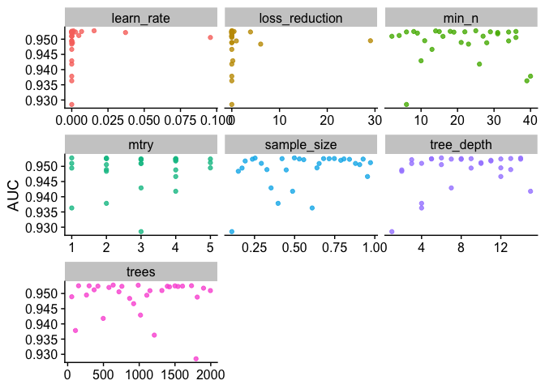

Supplemental material for in-progress Mountain Rain or Snow Manuscript
================
Keith Jennings
Sys.Date()

# Info

This documents includes supplemental material for an in-progress
manuscript.

# The necessary stuff

Import the packages we need.

``` r
# Load R packages
library(tidyverse)
library(tidymodels)
library(cowplot); theme_set(theme_cowplot())
```

``` r
# removed cache=TRUE, cache.lazy = FALSE
# `cache=TRUE` keeps the data stored and prevents it from being read in anew each time

# Data directory prefix
# Specific to my computer, change before sharing
data_pre <- "../../../../data/"


# Load the tuning data
# These are local files (update document if moved)
cs_tune_rf <- readRDS(paste0(data_pre, "rf_tune_imbal_CS.RDS"))
nh_tune_rf <- readRDS(paste0(data_pre, "rf_tune_imbal_NH.RDS"))
cs_tune_xg <- readRDS(paste0(data_pre, "xg_tune_imbal_CS.RDS"))
nh_tune_xg <- readRDS(paste0(data_pre, "xg_tune_imbal_NH.RDS"))
cs_tune_nn <- readRDS(paste0(data_pre, "nn_tune_imbal_CS.RDS"))
nh_tune_nn <- readRDS(paste0(data_pre, "nn_tune_imbal_NH.RDS"))

# Load the training data
cs_nomix_train <- readRDS(paste0(data_pre, "cs_nomix_df_train.RDS"))
cs_allphase_train <- readRDS(paste0(data_pre, "cs_allphase_df_train.RDS"))
nh_nomix_train <- readRDS(paste0(data_pre, "nh_nomix_df_train.RDS"))
```

# Supplemental Information

## Hyperparameter tuning

Both random forest and XGBoost have hyperparameters that can be tuned to
optimize model performance. To prevent data leakage, we only used the
75% training split of the crowdsourced and synoptic datasets to tune the
hyperparameters for each model. We used all observations from the
training split of the crowdsourced dataset (n = 25491 for rain and snow
only, and n = 28909 for rain, snow, and mixed) and 1% of the
observations from the synoptic dataset (n = 1.33581^{5}). We created 10
folds of each dataset to run k-fold cross-validation. We used two
performance metrics to evaluate the models: accuracy and area under the
curve (AUC). The former represents the proportion of observations
correctly predicted and the latter corresponds to the area under the
receiver operating characteristic curve, which plots the true positive
rate against the false positive rate. Both metrics range from 0 to 1,
where 0 equals no observations correctly predicted and 1 equals all
observations correctly predicted.

### Random Forest

Random forest models have a limited set of hyperparameters. For this
work, we tuned mtry and trees using the values shown in Supplementary
Table 1. With three values of each hyperparameter, we had a total of
nine unique combinations of hyperparameters to evaluate.

Supplementary Table 1. Hyperparameter values for the random forest
tuning exercise.

| Hyperparameter | Value 1 | Value 2 | Value 3 |
|----------------|:-------:|:-------:|:-------:|
| mtry           |    3    |    4    |    5    |
| trees          |   100   |   300   |   500   |

We found that mean accuracy and ROC were insensitive to the choice of
hyperparameters in all configurations with almost no variation in either
metric. For the crowdsourced dataset with just rain and snow, mean
accuracy ranged from 0.891 to 0.892 and mean AUC ranged from 0.943 to
0.944 (Supplementary Table 2). For the crowdsourced data with mixed
precipitation, mean accuracy ranged from 0.773 to 0.775 and mean AUC
ranged from 0.799 to 0.801 (Supplementary Table 3). For the synoptic
dataset, mean accuracy ranged from 0.923 to 0.923 and mean AUC ranged
from 0.968 to 0.969 (Supplementary Table 4).

Supplementary Table 2. Mean accuracy and AUC values for the random
forest hyperparameter tuning exercise for the crowdsourced dataset with
rain and snow only.

``` r
# Create a table with summarized values
cs_tune_rf$nomix_imbal$rf_tune_results %>% 
  select(mtry:.metric, mean) %>% 
  pivot_wider(id_cols = c(mtry, trees),
              names_from = .metric,
              values_from = mean) %>% 
  knitr::kable(digits = 3, 
               col.names = c("mtry", "trees", "Accuracy", "AUC"))
```

| mtry | trees | Accuracy |   AUC |
|-----:|------:|---------:|------:|
|    3 |   100 |    0.892 | 0.943 |
|    4 |   100 |    0.891 | 0.943 |
|    5 |   100 |    0.891 | 0.943 |
|    3 |   300 |    0.892 | 0.944 |
|    4 |   300 |    0.891 | 0.944 |
|    5 |   300 |    0.891 | 0.944 |
|    3 |   500 |    0.892 | 0.944 |
|    4 |   500 |    0.891 | 0.944 |
|    5 |   500 |    0.892 | 0.944 |

Supplementary Table 3. Mean accuracy and AUC values for the random
forest hyperparameter tuning exercise for the crowdsourced dataset with
rain, snow, and mixed precipitation

``` r
# Create a table with summarized values
cs_tune_rf$allphase_imbal$rf_tune_results %>% 
  select(mtry:.metric, mean) %>% 
  pivot_wider(id_cols = c(mtry, trees),
              names_from = .metric,
              values_from = mean) %>% 
  knitr::kable(digits = 3, 
               col.names = c("mtry", "trees", "Accuracy", "AUC"))
```

| mtry | trees | Accuracy |   AUC |
|-----:|------:|---------:|------:|
|    3 |   100 |    0.773 | 0.799 |
|    4 |   100 |    0.774 | 0.800 |
|    5 |   100 |    0.773 | 0.799 |
|    3 |   300 |    0.774 | 0.800 |
|    4 |   300 |    0.774 | 0.801 |
|    5 |   300 |    0.774 | 0.801 |
|    3 |   500 |    0.774 | 0.800 |
|    4 |   500 |    0.774 | 0.801 |
|    5 |   500 |    0.775 | 0.801 |

Supplementary Table 4. Mean accuracy and AUC values for the random
forest hyperparameter tuning exercise for the synoptic dataset with rain
and snow only.

``` r
# Create a table with summarized values
nh_tune_rf$nomix_imbal$rf_tune_results %>% 
  select(mtry:.metric, mean) %>% 
  pivot_wider(id_cols = c(mtry, trees),
              names_from = .metric,
              values_from = mean) %>% 
  knitr::kable(digits = 3, 
               col.names = c("mtry", "trees", "Accuracy", "AUC"))
```

| mtry | trees | Accuracy |   AUC |
|-----:|------:|---------:|------:|
|    3 |   100 |    0.923 | 0.968 |
|    4 |   100 |    0.923 | 0.968 |
|    5 |   100 |    0.923 | 0.968 |
|    3 |   300 |    0.923 | 0.968 |
|    4 |   300 |    0.923 | 0.968 |
|    5 |   300 |    0.923 | 0.969 |
|    3 |   500 |    0.923 | 0.968 |
|    4 |   500 |    0.923 | 0.969 |
|    5 |   500 |    0.923 | 0.969 |

We used the optimized hyperparameter values in Supplementary Table 5 to
run the random forest models.

Supplementary Table 5. Optimized hyperparameters for the random forest
models.

``` r
# Create a table of the best parameters
rf_best_hyperparms <- bind_rows(
  cs_tune_rf$nomix_imbal$param_best,
  cs_tune_rf$allphase_imbal$param_best,
  nh_tune_rf$nomix_imbal$param_best
) %>% 
  mutate(dataset = c("Crowdsourced with rain and snow",
                     "Crowdsourced with rain, snow, and mixed",
                     "Synoptic with rain and snow")) %>% 
  select(dataset, mtry, trees)
rf_best_hyperparms %>% 
  knitr::kable()
```

| dataset                                 | mtry | trees |
|:----------------------------------------|-----:|------:|
| Crowdsourced with rain and snow         |    3 |   300 |
| Crowdsourced with rain, snow, and mixed |    5 |   500 |
| Synoptic with rain and snow             |    4 |   500 |

### XGBoost

The XGBoost models utilize a greater number of hyperparameters and thus
required a slightly different tuning approach. Here, instead of
prescribing the hyperparameter values and combinations as we did for
random forest, we created a 30 element latin hypercube (Supplementary
Table 6) of the hyperparameter space across ten folds of the data.

Supplementary Table 6. Minimum, average, and maximum hyperparameter
values for the XGBoost tuning exercise.

``` r
# get all of the hyperparameter values
xg_hyperparams <- bind_rows(
  cs_tune_xg$nomix_imbal$xg_tune_results,
  cs_tune_xg$allphase_imbal$xg_tune_results,
  nh_tune_xg$nomix_imbal$xg_tune_results
) %>% 
  select(mtry:loss_reduction) %>% 
  pivot_longer(cols = mtry:loss_reduction,
               names_to = "hyperparam") %>% 
  group_by(hyperparam) %>% 
  summarize(min = round(min(value), digits = 2),
            avg = round(mean(value), digits = 2),
            max = round(max(value), digits = 2))

# make a table
xg_hyperparams %>% 
  knitr::kable()
```

| hyperparam     | min |    avg |     max |
|:---------------|----:|-------:|--------:|
| learn_rate     |   0 |   0.01 |    0.10 |
| loss_reduction |   0 |   1.26 |   29.05 |
| min_n          |   2 |  20.99 |   40.00 |
| mtry           |   1 |   3.16 |    6.00 |
| tree_depth     |   1 |   8.02 |   15.00 |
| trees          |  13 | 997.99 | 1995.00 |

XGBoost peformance was more sensitive to the choice of hyperparameter
values than random forest. For the crowdsourced dataset with just rain
and snow, mean accuracy ranged from 0.881 to 0.899 and mean AUC ranged
from 0.929 to 0.953 (Supplementary Table 7). For the crowdsourced data
with mixed precipitation, mean accuracy ranged from 0.118 to 0.79 and
mean AUC ranged from 0.5 to 0.825 (Supplementary Table 8). For the
synoptic dataset, mean accuracy ranged from 0.532 to 0.932 and mean AUC
ranged from 0.5 to 0.976 (Supplementary Table 9).

However, much of the variation in XGBoost output resulted from the poor
performance of the lowest learn rate values. If we exclude values of
this parameter that are less than 0.001, then the accuracy and AUC
ranges become markedly smaller. For the crowdsourced dataset with just
rain and snow, mean accuracy ranged from 0.896 to 0.899 and mean AUC
ranged from 0.951 to 0.953 when excluding the lowest learn rate values.
It was a similar story for the crowdsourced data with mixed
precipitation, where mean accuracy with these data points removed ranged
from 0.777 to 0.79 and mean AUC ranged from 0.809 to 0.825. It was more
of the same for the synoptic dataset with mean accuracy ranging from
0.931 to 0.932 and mean AUC ranging from 0.975 to 0.976.

Supplementary Table 7. Mean accuracy and AUC values for the XGBoost
hyperparameter tuning exercise for the crowdsourced dataset with rain
and snow only.

``` r
# Create a table with summarized values
cs_tune_xg$nomix_imbal$xg_tune_results %>% 
  select(mtry:.metric, mean) %>% 
  pivot_wider(id_cols = c(mtry, trees, min_n, tree_depth, learn_rate,
                          loss_reduction, sample_size),
              names_from = .metric,
              values_from = mean) %>% 
  mutate_if(is.numeric, funs(as.character(signif(., 3)))) %>% 
  knitr::kable(digits = 3, 
               col.names = c("mtry", "trees","min_n", "tree depth", "learn rate",
                             "loss reduction", "sample size", "Accuracy", "AUC"))
```

    ## Warning: `funs()` was deprecated in dplyr 0.8.0.
    ## ℹ Please use a list of either functions or lambdas:
    ## 
    ## # Simple named list: list(mean = mean, median = median)
    ## 
    ## # Auto named with `tibble::lst()`: tibble::lst(mean, median)
    ## 
    ## # Using lambdas list(~ mean(., trim = .2), ~ median(., na.rm = TRUE))
    ## Call `lifecycle::last_lifecycle_warnings()` to see where this warning was
    ## generated.

| mtry | trees | min_n | tree depth | learn rate | loss reduction | sample size | Accuracy | AUC   |
|:-----|:------|:------|:-----------|:-----------|:---------------|:------------|:---------|:------|
| 3    | 1790  | 6     | 1          | 4.6e-08    | 1.94e-05       | 0.108       | 0.895    | 0.929 |
| 2    | 866   | 23    | 2          | 1.98e-07   | 6.05           | 0.149       | 0.895    | 0.948 |
| 4    | 1810  | 28    | 2          | 0.000498   | 0.00214        | 0.448       | 0.894    | 0.949 |
| 3    | 1150  | 16    | 3          | 1.39e-05   | 0.000676       | 0.653       | 0.897    | 0.951 |
| 3    | 1420  | 31    | 3          | 0.0371     | 4.47e-10       | 0.557       | 0.897    | 0.952 |
| 1    | 1320  | 27    | 4          | 8.65e-05   | 5.35e-07       | 0.293       | 0.897    | 0.951 |
| 1    | 1210  | 39    | 4          | 1.77e-10   | 2.59e-06       | 0.609       | 0.881    | 0.936 |
| 2    | 109   | 40    | 4          | 5.26e-09   | 9.1e-08        | 0.397       | 0.893    | 0.938 |
| 4    | 1500  | 15    | 5          | 7.19e-08   | 3.14e-05       | 0.715       | 0.897    | 0.953 |
| 5    | 423   | 22    | 5          | 0.000201   | 6.84e-05       | 0.808       | 0.897    | 0.952 |
| 1    | 636   | 25    | 6          | 0.0154     | 0.00667        | 0.499       | 0.898    | 0.953 |
| 2    | 717   | 36    | 6          | 0.0956     | 0.00081        | 0.906       | 0.896    | 0.951 |
| 3    | 1390  | 6     | 7          | 3.45e-06   | 3.91           | 0.927       | 0.897    | 0.952 |
| 3    | 1020  | 10    | 7          | 3.47e-10   | 0.208          | 0.353       | 0.89     | 0.943 |
| 3    | 1540  | 19    | 8          | 1.23e-06   | 0.000238       | 0.842       | 0.898    | 0.952 |
| 2    | 152   | 36    | 8          | 2.86e-06   | 0.474          | 0.681       | 0.897    | 0.953 |
| 4    | 300   | 8     | 9          | 0.00678    | 0.0207         | 0.422       | 0.899    | 0.953 |
| 1    | 1110  | 34    | 9          | 7.07e-09   | 0.95           | 0.172       | 0.895    | 0.949 |
| 3    | 2000  | 2     | 10         | 1.67e-09   | 7.12e-09       | 0.88        | 0.896    | 0.951 |
| 5    | 370   | 4     | 10         | 0.00487    | 4.14e-08       | 0.973       | 0.896    | 0.951 |
| 4    | 577   | 9     | 11         | 4.53e-07   | 8.31e-07       | 0.788       | 0.899    | 0.952 |
| 4    | 1900  | 31    | 11         | 0.000198   | 1.23e-07       | 0.192       | 0.895    | 0.952 |
| 5    | 263   | 11    | 12         | 8.82e-06   | 29.1           | 0.639       | 0.898    | 0.949 |
| 4    | 922   | 13    | 12         | 1.34e-09   | 1.08e-09       | 0.955       | 0.895    | 0.947 |
| 3    | 1600  | 29    | 12         | 4.54e-05   | 0.145          | 0.53        | 0.896    | 0.952 |
| 2    | 1730  | 18    | 13         | 2.29e-07   | 0.0573         | 0.748       | 0.898    | 0.953 |
| 2    | 57    | 21    | 13         | 1.95e-08   | 1.65e-09       | 0.327       | 0.897    | 0.949 |
| 2    | 986   | 14    | 14         | 0.00118    | 1.51e-10       | 0.253       | 0.898    | 0.953 |
| 4    | 758   | 34    | 14         | 0.00265    | 8.2e-06        | 0.237       | 0.897    | 0.952 |
| 4    | 497   | 26    | 15         | 7.72e-10   | 9.63e-09       | 0.487       | 0.89     | 0.942 |

Supplementary Table 8. Mean accuracy and AUC values for the XGBoost
hyperparameter tuning exercise for the crowdsourced dataset with rain,
snow, and mixed precipitation

``` r
# Create a table with summarized values
cs_tune_xg$allphase_imbal$xg_tune_results %>% 
  select(mtry:.metric, mean) %>% 
  pivot_wider(id_cols = c(mtry, trees, min_n, tree_depth, learn_rate,
                          loss_reduction, sample_size),
              names_from = .metric,
              values_from = mean) %>% 
  mutate_if(is.numeric, funs(as.character(signif(., 3)))) %>% 
  knitr::kable(digits = 3, 
               col.names = c("mtry", "trees","min_n", "tree depth", "learn rate",
                             "loss reduction", "sample size", "Accuracy", "AUC"))
```

    ## Warning: `funs()` was deprecated in dplyr 0.8.0.
    ## ℹ Please use a list of either functions or lambdas:
    ## 
    ## # Simple named list: list(mean = mean, median = median)
    ## 
    ## # Auto named with `tibble::lst()`: tibble::lst(mean, median)
    ## 
    ## # Using lambdas list(~ mean(., trim = .2), ~ median(., na.rm = TRUE))
    ## Call `lifecycle::last_lifecycle_warnings()` to see where this warning was
    ## generated.

| mtry | trees | min_n | tree depth | learn rate | loss reduction | sample size | Accuracy | AUC   |
|:-----|:------|:------|:-----------|:-----------|:---------------|:------------|:---------|:------|
| 2    | 1750  | 33    | 1          | 0.000196   | 0.0324         | 0.115       | 0.788    | 0.801 |
| 1    | 181   | 25    | 2          | 0.00124    | 7.52e-07       | 0.859       | 0.788    | 0.814 |
| 2    | 1150  | 36    | 2          | 0.0393     | 0.0203         | 0.908       | 0.789    | 0.824 |
| 1    | 1040  | 19    | 3          | 0.00506    | 0.171          | 0.284       | 0.79     | 0.825 |
| 4    | 1630  | 30    | 3          | 0.00948    | 3.54e-05       | 0.953       | 0.789    | 0.824 |
| 4    | 389   | 7     | 4          | 5.76e-07   | 1.52e-08       | 0.323       | 0.789    | 0.824 |
| 3    | 1460  | 14    | 4          | 0.077      | 1.16e-09       | 0.592       | 0.782    | 0.815 |
| 4    | 1810  | 3     | 5          | 2.49e-05   | 6.71e-05       | 0.742       | 0.789    | 0.824 |
| 5    | 1540  | 12    | 5          | 1.08e-10   | 2.4e-10        | 0.57        | 0.118    | 0.5   |
| 3    | 577   | 31    | 5          | 5.88e-05   | 0.108          | 0.537       | 0.789    | 0.824 |
| 2    | 1100  | 13    | 6          | 5.73e-10   | 2.02           | 0.362       | 0.118    | 0.5   |
| 3    | 1670  | 32    | 7          | 4.13e-08   | 0.000388       | 0.157       | 0.788    | 0.819 |
| 2    | 301   | 34    | 7          | 2.39e-06   | 0.843          | 0.468       | 0.789    | 0.824 |
| 4    | 13    | 38    | 7          | 0.000237   | 8.33e-08       | 0.197       | 0.789    | 0.823 |
| 5    | 730   | 8     | 8          | 1.3e-09    | 4.39e-08       | 0.82        | 0.118    | 0.5   |
| 3    | 792   | 28    | 8          | 2.79e-05   | 2.41e-07       | 0.425       | 0.789    | 0.824 |
| 1    | 935   | 10    | 9          | 2.17e-10   | 0.00496        | 0.629       | 0.118    | 0.5   |
| 2    | 1220  | 23    | 9          | 1.67e-08   | 2.45e-10       | 0.391       | 0.118    | 0.5   |
| 5    | 1940  | 17    | 10         | 6.36e-09   | 2.56e-06       | 0.708       | 0.118    | 0.5   |
| 3    | 218   | 25    | 10         | 0.00199    | 2.74           | 0.272       | 0.789    | 0.824 |
| 3    | 424   | 37    | 10         | 3.19e-07   | 0.00209        | 0.246       | 0.789    | 0.824 |
| 3    | 1360  | 20    | 11         | 1.45e-06   | 0.001          | 0.763       | 0.789    | 0.822 |
| 3    | 620   | 21    | 11         | 9.39e-06   | 0.000148       | 0.996       | 0.787    | 0.82  |
| 4    | 492   | 3     | 12         | 8.97e-08   | 21.4           | 0.645       | 0.789    | 0.811 |
| 2    | 1880  | 16    | 12         | 0.0199     | 6.83e-06       | 0.811       | 0.777    | 0.809 |
| 2    | 1520  | 15    | 13         | 4.52e-09   | 4.85e-09       | 0.455       | 0.118    | 0.5   |
| 4    | 920   | 5     | 14         | 1.58e-07   | 3.14e-09       | 0.926       | 0.784    | 0.814 |
| 4    | 1290  | 6     | 14         | 1.95e-09   | 2.3e-05        | 0.678       | 0.118    | 0.5   |
| 1    | 90    | 39    | 14         | 0.000671   | 12.9           | 0.495       | 0.79     | 0.821 |
| 5    | 804   | 27    | 15         | 3.64e-06   | 3.36e-07       | 0.187       | 0.788    | 0.824 |

Supplementary Table 9. Mean accuracy and AUC values for the XGBoost
hyperparameter tuning exercise for the synoptic dataset with rain and
snow only.

``` r
# Create a table with summarized values
nh_tune_xg$nomix_imbal$xg_tune_results %>% 
  select(mtry:.metric, mean) %>% 
  pivot_wider(id_cols = c(mtry, trees, min_n, tree_depth, learn_rate,
                          loss_reduction, sample_size),
              names_from = .metric,
              values_from = mean) %>% 
  mutate_if(is.numeric, funs(as.character(signif(., 3)))) %>% 
  knitr::kable(digits = 3, 
               col.names = c("mtry", "trees","min_n", "tree depth", "learn rate",
                             "loss reduction", "sample size", "Accuracy", "AUC"))
```

    ## Warning: `funs()` was deprecated in dplyr 0.8.0.
    ## ℹ Please use a list of either functions or lambdas:
    ## 
    ## # Simple named list: list(mean = mean, median = median)
    ## 
    ## # Auto named with `tibble::lst()`: tibble::lst(mean, median)
    ## 
    ## # Using lambdas list(~ mean(., trim = .2), ~ median(., na.rm = TRUE))
    ## Call `lifecycle::last_lifecycle_warnings()` to see where this warning was
    ## generated.

| mtry | trees | min_n | tree depth | learn rate | loss reduction | sample size | Accuracy | AUC   |
|:-----|:------|:------|:-----------|:-----------|:---------------|:------------|:---------|:------|
| 6    | 679   | 20    | 1          | 1.44e-09   | 1.68e-09       | 0.21        | 0.931    | 0.936 |
| 4    | 1360  | 8     | 2          | 4.3e-08    | 11.2           | 0.233       | 0.931    | 0.97  |
| 4    | 459   | 19    | 2          | 0.0676     | 2.52e-05       | 0.185       | 0.931    | 0.975 |
| 4    | 1400  | 3     | 3          | 0.0425     | 9.92e-05       | 0.252       | 0.932    | 0.976 |
| 6    | 1070  | 25    | 3          | 8.82e-06   | 16.8           | 0.798       | 0.931    | 0.972 |
| 2    | 1090  | 14    | 4          | 1.14e-08   | 6.42e-07       | 0.629       | 0.931    | 0.974 |
| 6    | 1870  | 31    | 4          | 6.76e-08   | 0.0543         | 0.741       | 0.931    | 0.974 |
| 1    | 139   | 16    | 5          | 2.03e-10   | 0.509          | 0.556       | 0.532    | 0.5   |
| 1    | 758   | 40    | 5          | 9.6e-07    | 5.39e-08       | 0.825       | 0.931    | 0.974 |
| 2    | 1880  | 8     | 6          | 0.00036    | 0.201          | 0.135       | 0.931    | 0.975 |
| 4    | 549   | 15    | 6          | 0.00889    | 3.25e-08       | 0.29        | 0.932    | 0.975 |
| 3    | 130   | 28    | 6          | 0.00277    | 0.00134        | 0.643       | 0.931    | 0.975 |
| 4    | 853   | 24    | 7          | 2.91e-05   | 3.48e-09       | 0.69        | 0.931    | 0.975 |
| 4    | 357   | 35    | 7          | 3.87e-06   | 0.091          | 0.765       | 0.931    | 0.975 |
| 2    | 245   | 5     | 8          | 2.18e-06   | 0.00909        | 0.86        | 0.932    | 0.975 |
| 5    | 1970  | 13    | 8          | 0.00443    | 5e-10          | 0.932       | 0.932    | 0.976 |
| 3    | 53    | 3     | 9          | 4.93e-07   | 0.014          | 0.902       | 0.932    | 0.975 |
| 1    | 1260  | 31    | 9          | 2.23e-07   | 0.00302        | 0.467       | 0.931    | 0.975 |
| 5    | 485   | 36    | 9          | 5.4e-09    | 2.29           | 0.601       | 0.931    | 0.974 |
| 2    | 1570  | 11    | 10         | 6.71e-05   | 1.33           | 0.715       | 0.931    | 0.975 |
| 3    | 1150  | 38    | 10         | 1.74e-07   | 0.000349       | 0.547       | 0.931    | 0.975 |
| 2    | 1470  | 12    | 11         | 0.000951   | 8.33e-09       | 0.407       | 0.931    | 0.975 |
| 2    | 646   | 33    | 11         | 0.000589   | 4.65e-06       | 0.506       | 0.931    | 0.975 |
| 3    | 934   | 29    | 12         | 1.16e-10   | 0.000209       | 0.431       | 0.847    | 0.959 |
| 3    | 293   | 6     | 13         | 1e-04      | 1e-05          | 0.967       | 0.931    | 0.975 |
| 5    | 1270  | 23    | 13         | 1.61e-09   | 3.03e-06       | 0.973       | 0.931    | 0.973 |
| 5    | 1670  | 26    | 13         | 5.56e-10   | 7.11e-10       | 0.365       | 0.931    | 0.973 |
| 5    | 1740  | 22    | 14         | 0.0131     | 2.02e-07       | 0.396       | 0.932    | 0.976 |
| 5    | 910   | 18    | 15         | 1.46e-08   | 1.37e-06       | 0.126       | 0.931    | 0.974 |
| 3    | 1600  | 37    | 15         | 1.97e-05   | 1.33e-10       | 0.321       | 0.931    | 0.975 |

We used the optimized hyperparameter values in Supplementary Table 10 to
run the XGBoost models.

Supplementary Table 10. Optimized hyperparameters for the XGBoost
models.

``` r
# Create a table of the best parameters
xg_best_hyperparms <- bind_rows(
  cs_tune_xg$nomix_imbal$param_best,
  cs_tune_xg$allphase_imbal$param_best,
  nh_tune_xg$nomix_imbal$param_best
) %>% 
  mutate(dataset = c("Crowdsourced with rain and snow",
                     "Crowdsourced with rain, snow, and mixed",
                     "Synoptic with rain and snow")) %>% 
  select(dataset, mtry:sample_size)
xg_best_hyperparms %>% 
  mutate_if(is.numeric, funs(as.character(signif(., 3)))) %>% 
  knitr::kable()
```

    ## Warning: `funs()` was deprecated in dplyr 0.8.0.
    ## ℹ Please use a list of either functions or lambdas:
    ## 
    ## # Simple named list: list(mean = mean, median = median)
    ## 
    ## # Auto named with `tibble::lst()`: tibble::lst(mean, median)
    ## 
    ## # Using lambdas list(~ mean(., trim = .2), ~ median(., na.rm = TRUE))
    ## Call `lifecycle::last_lifecycle_warnings()` to see where this warning was
    ## generated.

| dataset | mtry | trees | min_n | tree_depth | learn_rate | loss_reduction | sample_size |
|:---|:---|:---|:---|:---|:---|:---|:---|
| Crowdsourced with rain and snow | 4 | 577 | 9 | 11 | 4.53e-07 | 8.31e-07 | 0.788 |
| Crowdsourced with rain, snow, and mixed | 1 | 1040 | 19 | 3 | 0.00506 | 0.171 | 0.284 |
| Synoptic with rain and snow | 4 | 1400 | 3 | 3 | 0.0425 | 9.92e-05 | 0.252 |

``` r
cs_tune_xg$nomix_imbal$xg_tune_results %>%
  filter(.metric == "roc_auc") %>%
  select(mean, mtry:sample_size) %>%
  pivot_longer(mtry:sample_size,
               values_to = "value",
               names_to = "parameter"
  ) %>%
  ggplot(aes(value, mean, color = parameter)) +
  geom_point(alpha = 0.8, show.legend = FALSE) +
  facet_wrap(~parameter, scales = "free_x") +
  labs(x = NULL, y = "AUC")
```

<!-- --> \### ANN
The specific ANN we deployed is a multilayer perceptron, a feed-forward
neural network. We used one hidden layer, Rectified Linear Unit (ReLU)
activation, and the Limited-memory Broyden-Fletcher-Goldfarb-Shanno
(LBGFS) optimization algorithm. As we did for XGBoost, we created a 30
element Latin hypercube (Supplementary Table 11) of the tunable
hyperparameters. We then tuned these values using 10 folds of the
training data.

Supplementary Table 11. Minimum, average, and maximum hyperparameter
values for the ANN tuning exercise.

``` r
# get all of the hyperparameter values
nn_hyperparams <- bind_rows(
  cs_tune_nn$nomix_imbal$nn_tune_results,
  cs_tune_nn$allphase_imbal$nn_tune_results,
  nh_tune_nn$nomix_imbal$xg_tune_results
) %>% 
  select(hidden_units:learn_rate) %>% 
  pivot_longer(cols = hidden_units:learn_rate,
               names_to = "hyperparam") %>% 
  group_by(hyperparam) %>% 
  summarize(min = min(value),
            avg = mean(value),
            max = max(value)) %>% 
  mutate_if(is.numeric, funs(as.character(signif(., 3)))) 
```

    ## Warning: `funs()` was deprecated in dplyr 0.8.0.
    ## ℹ Please use a list of either functions or lambdas:
    ## 
    ## # Simple named list: list(mean = mean, median = median)
    ## 
    ## # Auto named with `tibble::lst()`: tibble::lst(mean, median)
    ## 
    ## # Using lambdas list(~ mean(., trim = .2), ~ median(., na.rm = TRUE))
    ## Call `lifecycle::last_lifecycle_warnings()` to see where this warning was
    ## generated.

``` r
# make a table
nn_hyperparams %>% 
  knitr::kable(digits = 2)
```

| hyperparam   | min      | avg    | max    |
|:-------------|:---------|:-------|:-------|
| epochs       | 39       | 509    | 994    |
| hidden_units | 1        | 5.5    | 10     |
| learn_rate   | 1.15e-10 | 0.0049 | 0.0657 |
| penalty      | 2.04e-10 | 0.039  | 0.559  |

Like XGBoost, ANN peformance was more sensitive to the choice of
hyperparameter values than random forest. For the crowdsourced dataset
with just rain and snow, mean accuracy ranged from 0.375 to 0.898 and
mean AUC ranged from 0.247 to 0.953 (Supplementary Table 7). For the
crowdsourced data with mixed precipitation, mean accuracy ranged from
0.249 to 0.79 and mean AUC ranged from 0.446 to 0.821 (Supplementary
Table 8). For the synoptic dataset, mean accuracy ranged from 0.457 to
0.927 and mean AUC ranged from 0.439 to 0.974 (Supplementary Table 9).

Again similar to XGBoost, much of the variation in the ANN output
resulted from the poor performance of the lowest learn rate values. If
we exclude values of this parameter that are less than 0.001, then the
accuracy and AUC ranges become markedly smaller. For the crowdsourced
dataset with just rain and snow, mean accuracy ranged from 0.771 to
0.898 and mean AUC ranged from 0.712 to 0.953 when excluding the lowest
learn rate values. It was a similar story for the crowdsourced data with
mixed precipitation, where mean accuracy with these data points removed
ranged from 0.643 to 0.79 and mean AUC ranged from 0.652 to 0.821. It
was more of the same for the synoptic dataset with mean accuracy ranging
from 0.749 to 0.922 and mean AUC ranging from 0.743 to 0.973.

Supplementary Table 12. Mean accuracy and AUC values for the ANN
hyperparameter tuning exercise for the crowdsourced dataset with rain
and snow only.

``` r
# Create a table with summarized values
cs_tune_nn$nomix_imbal$nn_tune_results %>% 
  select(hidden_units:.metric, mean) %>% 
  pivot_wider(id_cols = c(epochs, hidden_units, learn_rate, penalty),
              names_from = .metric,
              values_from = mean) %>% 
  mutate_if(is.numeric, funs(as.character(signif(., 3)))) %>% 
  knitr::kable(digits = 3, 
               col.names = c("epochs", "hidden units", "learn rate", "penalty",
                             "Accuracy", "AUC"))
```

    ## Warning: `funs()` was deprecated in dplyr 0.8.0.
    ## ℹ Please use a list of either functions or lambdas:
    ## 
    ## # Simple named list: list(mean = mean, median = median)
    ## 
    ## # Auto named with `tibble::lst()`: tibble::lst(mean, median)
    ## 
    ## # Using lambdas list(~ mean(., trim = .2), ~ median(., na.rm = TRUE))
    ## Call `lifecycle::last_lifecycle_warnings()` to see where this warning was
    ## generated.

| epochs | hidden units | learn rate | penalty  | Accuracy | AUC   |
|:-------|:-------------|:-----------|:---------|:---------|:------|
| 333    | 3            | 3.59e-09   | 2.91e-05 | 0.49     | 0.396 |
| 456    | 7            | 2.31e-07   | 0.000165 | 0.537    | 0.667 |
| 865    | 5            | 8.78e-10   | 0.00108  | 0.467    | 0.36  |
| 536    | 2            | 8.79e-09   | 0.000372 | 0.591    | 0.507 |
| 903    | 7            | 7.26e-05   | 0.559    | 0.818    | 0.848 |
| 635    | 9            | 0.00422    | 1.49e-06 | 0.898    | 0.953 |
| 795    | 1            | 3.2e-05    | 0.299    | 0.654    | 0.491 |
| 132    | 6            | 6.91e-07   | 2.04e-10 | 0.542    | 0.61  |
| 224    | 9            | 3.66e-06   | 1.29e-07 | 0.54     | 0.638 |
| 148    | 1            | 0.0657     | 0.0231   | 0.771    | 0.712 |
| 425    | 4            | 1.15e-10   | 4.13e-10 | 0.454    | 0.527 |
| 304    | 4            | 0.000314   | 0.0123   | 0.813    | 0.844 |
| 267    | 6            | 1.86e-07   | 9.77e-05 | 0.448    | 0.546 |
| 666    | 8            | 0.00187    | 0.00532  | 0.898    | 0.953 |
| 187    | 10           | 1.42e-06   | 1.09e-09 | 0.473    | 0.247 |
| 401    | 4            | 0.0188     | 0.000759 | 0.873    | 0.905 |
| 722    | 3            | 0.00132    | 0.21     | 0.896    | 0.952 |
| 823    | 2            | 0.00823    | 4.76e-10 | 0.837    | 0.815 |
| 994    | 5            | 5.37e-10   | 3.73e-08 | 0.375    | 0.306 |
| 567    | 4            | 0.00016    | 9.69e-08 | 0.834    | 0.848 |
| 476    | 8            | 3.77e-08   | 0.00392  | 0.519    | 0.368 |
| 354    | 6            | 0.00054    | 1.02e-08 | 0.897    | 0.951 |
| 895    | 10           | 1.29e-08   | 1.19e-05 | 0.497    | 0.521 |
| 39     | 8            | 1.78e-06   | 0.0549   | 0.6      | 0.548 |
| 587    | 7            | 1.9e-05    | 2.34e-07 | 0.571    | 0.559 |
| 741    | 9            | 3.55e-10   | 9.02e-06 | 0.428    | 0.516 |
| 967    | 3            | 8.2e-06    | 2.95e-06 | 0.586    | 0.554 |
| 673    | 2            | 5.09e-08   | 6.01e-07 | 0.434    | 0.536 |
| 44     | 7            | 2.74e-09   | 2.45e-09 | 0.616    | 0.455 |
| 102    | 5            | 0.0456     | 6.08e-09 | 0.881    | 0.948 |

Supplementary Table 13. Mean accuracy and AUC values for the ANN
hyperparameter tuning exercise for the crowdsourced dataset with rain,
snow, and mixed precipitation

``` r
# Create a table with summarized values
cs_tune_nn$allphase_imbal$nn_tune_results %>% 
  select(hidden_units:.metric, mean) %>% 
  pivot_wider(id_cols = c(epochs, hidden_units, learn_rate, penalty),
              names_from = .metric,
              values_from = mean) %>% 
  mutate_if(is.numeric, funs(as.character(signif(., 3)))) %>% 
  knitr::kable(digits = 3, 
               col.names = c("epochs", "hidden units", "learn rate", "penalty",
                             "Accuracy", "AUC"))
```

    ## Warning: `funs()` was deprecated in dplyr 0.8.0.
    ## ℹ Please use a list of either functions or lambdas:
    ## 
    ## # Simple named list: list(mean = mean, median = median)
    ## 
    ## # Auto named with `tibble::lst()`: tibble::lst(mean, median)
    ## 
    ## # Using lambdas list(~ mean(., trim = .2), ~ median(., na.rm = TRUE))
    ## Call `lifecycle::last_lifecycle_warnings()` to see where this warning was
    ## generated.

| epochs | hidden units | learn rate | penalty  | Accuracy | AUC   |
|:-------|:-------------|:-----------|:---------|:---------|:------|
| 333    | 3            | 3.59e-09   | 2.91e-05 | 0.399    | 0.478 |
| 456    | 7            | 2.31e-07   | 0.000165 | 0.357    | 0.545 |
| 865    | 5            | 8.78e-10   | 0.00108  | 0.249    | 0.529 |
| 536    | 2            | 8.79e-09   | 0.000372 | 0.323    | 0.493 |
| 903    | 7            | 7.26e-05   | 0.559    | 0.68     | 0.703 |
| 635    | 9            | 0.00422    | 1.49e-06 | 0.79     | 0.821 |
| 795    | 1            | 3.2e-05    | 0.299    | 0.399    | 0.524 |
| 132    | 6            | 6.91e-07   | 2.04e-10 | 0.311    | 0.484 |
| 224    | 9            | 3.66e-06   | 1.29e-07 | 0.464    | 0.565 |
| 148    | 1            | 0.0657     | 0.0231   | 0.643    | 0.652 |
| 425    | 4            | 1.15e-10   | 4.13e-10 | 0.332    | 0.519 |
| 304    | 4            | 0.000314   | 0.0123   | 0.71     | 0.735 |
| 267    | 6            | 1.86e-07   | 9.77e-05 | 0.3      | 0.531 |
| 666    | 8            | 0.00187    | 0.00532  | 0.785    | 0.82  |
| 187    | 10           | 1.42e-06   | 1.09e-09 | 0.51     | 0.512 |
| 401    | 4            | 0.0188     | 0.000759 | 0.731    | 0.745 |
| 722    | 3            | 0.00132    | 0.21     | 0.769    | 0.783 |
| 823    | 2            | 0.00823    | 4.76e-10 | 0.735    | 0.735 |
| 994    | 5            | 5.37e-10   | 3.73e-08 | 0.356    | 0.55  |
| 567    | 4            | 0.00016    | 9.69e-08 | 0.69     | 0.63  |
| 476    | 8            | 3.77e-08   | 0.00392  | 0.444    | 0.482 |
| 354    | 6            | 0.00054    | 1.02e-08 | 0.754    | 0.759 |
| 895    | 10           | 1.29e-08   | 1.19e-05 | 0.43     | 0.473 |
| 39     | 8            | 1.78e-06   | 0.0549   | 0.419    | 0.51  |
| 587    | 7            | 1.9e-05    | 2.34e-07 | 0.48     | 0.608 |
| 741    | 9            | 3.55e-10   | 9.02e-06 | 0.346    | 0.446 |
| 967    | 3            | 8.2e-06    | 2.95e-06 | 0.444    | 0.466 |
| 673    | 2            | 5.09e-08   | 6.01e-07 | 0.336    | 0.496 |
| 44     | 7            | 2.74e-09   | 2.45e-09 | 0.351    | 0.548 |
| 102    | 5            | 0.0456     | 6.08e-09 | 0.761    | 0.773 |

Supplementary Table 14. Mean accuracy and AUC values for the ANN
hyperparameter tuning exercise for the synoptic dataset with rain and
snow only.

``` r
# Create a table with summarized values
nh_tune_nn$nomix_imbal$nn_tune_results %>% 
  select(hidden_units:.metric, mean) %>% 
  pivot_wider(id_cols = c(epochs, hidden_units, learn_rate, penalty),
              names_from = .metric,
              values_from = mean) %>% 
  mutate_if(is.numeric, funs(as.character(signif(., 3)))) %>% 
  knitr::kable(digits = 3, 
               col.names = c("epochs", "hidden units", "learn rate", "penalty",
                             "Accuracy", "AUC"))
```

    ## Warning: `funs()` was deprecated in dplyr 0.8.0.
    ## ℹ Please use a list of either functions or lambdas:
    ## 
    ## # Simple named list: list(mean = mean, median = median)
    ## 
    ## # Auto named with `tibble::lst()`: tibble::lst(mean, median)
    ## 
    ## # Using lambdas list(~ mean(., trim = .2), ~ median(., na.rm = TRUE))
    ## Call `lifecycle::last_lifecycle_warnings()` to see where this warning was
    ## generated.

| epochs | hidden units | learn rate | penalty  | Accuracy | AUC   |
|:-------|:-------------|:-----------|:---------|:---------|:------|
| 491    | 9            | 7.24e-05   | 3.91e-09 | 0.599    | 0.598 |
| 407    | 6            | 4.47e-05   | 1.6e-05  | 0.484    | 0.582 |
| 231    | 7            | 2.47e-06   | 3.49e-07 | 0.528    | 0.595 |
| 550    | 8            | 0.00249    | 8.56e-06 | 0.849    | 0.882 |
| 840    | 3            | 1.23e-07   | 4.41e-10 | 0.5      | 0.563 |
| 330    | 8            | 0.0473     | 4.49e-06 | 0.901    | 0.973 |
| 692    | 3            | 3.7e-10    | 3.49e-08 | 0.512    | 0.493 |
| 392    | 5            | 3.06e-07   | 0.00473  | 0.498    | 0.559 |
| 43     | 3            | 9.13e-07   | 1.17e-08 | 0.526    | 0.525 |
| 135    | 2            | 3.63e-09   | 1.08e-10 | 0.504    | 0.478 |
| 974    | 5            | 0.0234     | 9.64e-07 | 0.82     | 0.872 |
| 510    | 2            | 0.000321   | 3.43e-05 | 0.771    | 0.783 |
| 794    | 6            | 0.000119   | 1.24e-09 | 0.822    | 0.855 |
| 613    | 6            | 4.67e-10   | 7.1e-09  | 0.505    | 0.475 |
| 202    | 4            | 4.48e-06   | 7.51e-08 | 0.506    | 0.564 |
| 642    | 2            | 0.000837   | 0.815    | 0.721    | 0.694 |
| 57     | 5            | 1.89e-09   | 6.09e-10 | 0.488    | 0.49  |
| 248    | 7            | 0.00918    | 0.000167 | 0.922    | 0.973 |
| 580    | 8            | 1.51e-09   | 1.58e-06 | 0.483    | 0.51  |
| 708    | 10           | 1.79e-05   | 0.0127   | 0.489    | 0.598 |
| 916    | 9            | 1.1e-05    | 0.00121  | 0.457    | 0.439 |
| 351    | 9            | 1.12e-08   | 2.11e-07 | 0.501    | 0.453 |
| 743    | 9            | 0.000503   | 0.000294 | 0.927    | 0.974 |
| 889    | 1            | 5.35e-07   | 0.0644   | 0.49     | 0.495 |
| 80     | 8            | 2.04e-08   | 0.00349  | 0.464    | 0.623 |
| 948    | 3            | 0.00368    | 0.109    | 0.749    | 0.743 |
| 823    | 7            | 1.51e-10   | 0.000758 | 0.494    | 0.562 |
| 456    | 1            | 8.21e-08   | 0.345    | 0.498    | 0.578 |
| 280    | 4            | 0.0522     | 0.0397   | 0.755    | 0.805 |
| 147    | 5            | 4.58e-08   | 9.55e-05 | 0.493    | 0.476 |

We used the optimized hyperparameter values in Supplementary Table 15 to
run the ANN models.

Supplementary Table 15. Optimized hyperparameters for the ANN models.

``` r
# Create a table of the best parameters
nn_best_hyperparms <- bind_rows(
  cs_tune_nn$nomix_imbal$param_best,
  cs_tune_nn$allphase_imbal$param_best,
  nh_tune_nn$nomix_imbal$param_best
) %>% 
  mutate(dataset = c("Crowdsourced with rain and snow",
                     "Crowdsourced with rain, snow, and mixed",
                     "Synoptic with rain and snow")) %>% 
  select(dataset, hidden_units:learn_rate)
nn_best_hyperparms %>% 
  mutate_if(is.numeric, funs(as.character(signif(., 3)))) %>% 
  knitr::kable()
```

    ## Warning: `funs()` was deprecated in dplyr 0.8.0.
    ## ℹ Please use a list of either functions or lambdas:
    ## 
    ## # Simple named list: list(mean = mean, median = median)
    ## 
    ## # Auto named with `tibble::lst()`: tibble::lst(mean, median)
    ## 
    ## # Using lambdas list(~ mean(., trim = .2), ~ median(., na.rm = TRUE))
    ## Call `lifecycle::last_lifecycle_warnings()` to see where this warning was
    ## generated.

| dataset | hidden_units | penalty | epochs | learn_rate |
|:---|:---|:---|:---|:---|
| Crowdsourced with rain and snow | 9 | 1.49e-06 | 635 | 0.00422 |
| Crowdsourced with rain, snow, and mixed | 9 | 1.49e-06 | 635 | 0.00422 |
| Synoptic with rain and snow | 9 | 0.000294 | 743 | 0.000503 |
