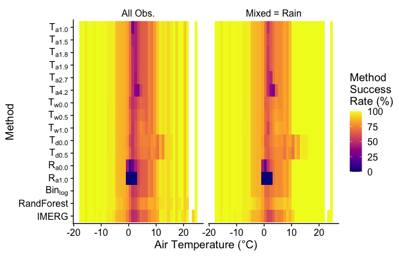
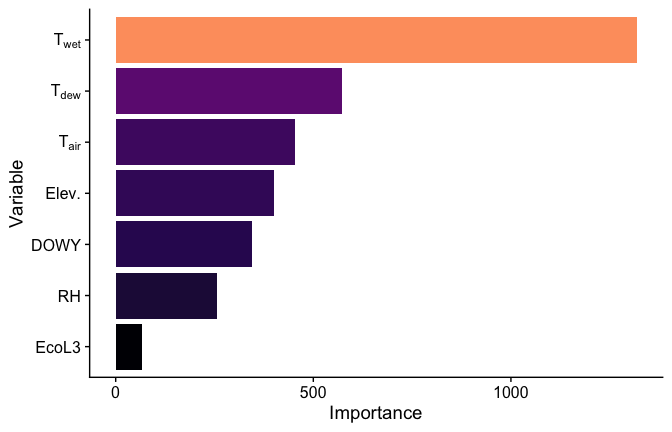
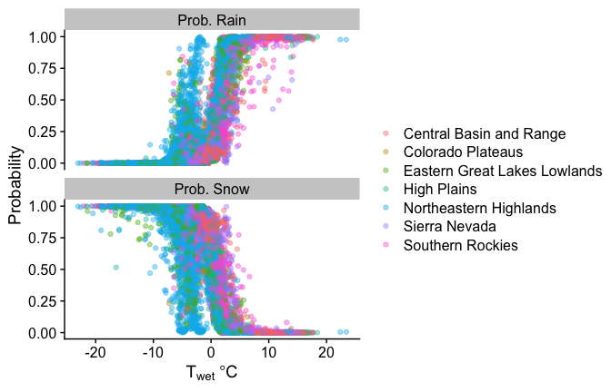
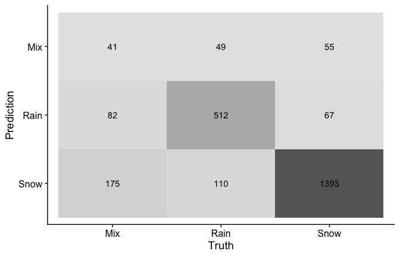
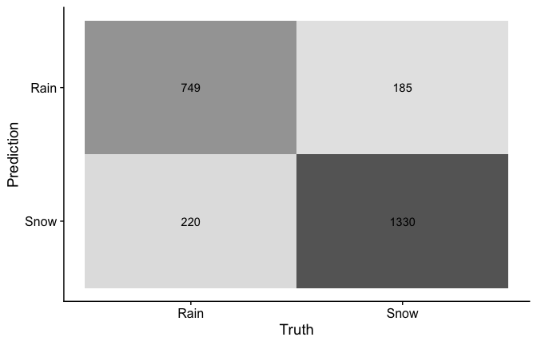

Mountain Rain or Snow AGU 2022 Analysis
================
Keith Jennings
2022-12-09

``` r
# Load the tidyverse and tidymodels
library(tidyverse)
library(tidymodels)
# Use cowplot for plot formatting and import plot styles
library(cowplot); theme_set(theme_cowplot())
library(vip) # variable importance plots

# Lubridate for date handling tools
library(lubridate)

# Import data
summary_byTair <- readRDS("../../data/processed/prediction/summary_output_byTair.RDS")
summary_allList <- readRDS("../../data/processed/prediction/summary_output_allList.RDS")
```

Make a success plot by tair

<!-- -->

Make a variable importance plot

<!-- -->

Explore var relationships from Random Forest

<!-- --> Make
confusion matrices

<!-- --><!-- -->
